# Geometric Transformation Vectors in Transformer Embedding Spaces

## Abstract

Transformer embedding spaces encode relations between paired sentences, but the current evidence must be stated carefully. We study controlled linguistic transformations and represent each pair by `delta = embedding(target) - embedding(source)`. Across BERT, RoBERTa, DistilRoBERTa, GPT-2, and DistilGPT-2, delta representations outperform source-only and target-only baselines in the multiseed full-semantic setting, with McNemar tests significant for every seed/model pair. However, strong endpoint leakage remains: target-only representations are already highly predictive, and the `syntax=1.0` holdout result should be treated as a red flag for surface-form cues rather than as a central achievement. The defensible current claim is that delta vectors add reproducible transformation information beyond target endpoints, especially for decoder models, not that they isolate pure context-independent operators.

## Evidence Map

Main scripts:

- Figure generation: [make_paper_figures.py](../../../scripts/make_paper_figures.py)
- Full semantic holdout: [lie_llm_full_semantic_holdout_experiment.py](../../../scripts/lie_llm_full_semantic_holdout_experiment.py)
- Syntax holdout: [lie_llm_syntax_holdout_experiment.py](../../../scripts/lie_llm_syntax_holdout_experiment.py)
- Syntax representation ablation: [run_syntax_representation_ablation.py](../../../scripts/run_syntax_representation_ablation.py)
- Layerwise/pooling syntax ablation: [run_layerwise_pooling_ablation.py](../../../scripts/run_layerwise_pooling_ablation.py)
- Modern-model spot-check: [run_track1_spotcheck.py](../../../scripts/run_track1_spotcheck.py)
- Full-semantic pooling ablation: [run_full_semantic_pooling_ablation.py](../../../scripts/run_full_semantic_pooling_ablation.py)
- Confusion/negation analysis: [analyze_confusion_negation.py](../../../scripts/analyze_confusion_negation.py)
- Diverse dataset experiment: [lie_llm_diverse_dataset_experiment.py](../../../scripts/lie_llm_diverse_dataset_experiment.py)
- Entity holdout: [lie_llm_entity_holdout_experiment.py](../../../scripts/lie_llm_entity_holdout_experiment.py)
- Variant holdout: [lie_llm_variant_holdout_experiment.py](../../../scripts/lie_llm_variant_holdout_experiment.py)
- Multiseed ablation: [lie_llm_y_only_ablation_multiseed.py](../../../scripts/lie_llm_y_only_ablation_multiseed.py)

Main result files:

- Legacy holdout summaries are retained only as diagnostics in experiment result folders; the old all-holdout comparison plot is intentionally excluded from the archival draft because the syntax split is target-leaky.
- Multiseed ablation summary: [ablation_multiseed_aggregated.csv](../../../results/ablation_multiseed_aggregated.csv)
- Reviewer ablation table: [reviewer_ablation_table.csv](../../../results/reviewer_ablation_table.csv)
- McNemar tests: [ablation_multiseed_mcnemar.csv](../../../results/ablation_multiseed_mcnemar.csv)
- Full semantic results: [full_semantic_holdout_summary.csv](../../../results/experiments/lie_llm_full_semantic_holdout_results/full_semantic_holdout_summary.csv)
- Syntax holdout results: [syntax_holdout_summary.csv](../../../results/experiments/lie_llm_syntax_results/syntax_holdout_summary.csv)
- Syntax representation ablation: [syntax_representation_ablation_pivot.csv](../../../results/experiments/syntax_representation_ablation_results/syntax_representation_ablation_pivot.csv)
- Layerwise/pooling syntax ablation: [layerwise_pooling_ablation_top20.csv](../../../results/experiments/layerwise_pooling_ablation_results/layerwise_pooling_ablation_top20.csv)
- DeBERTa-v3-small spot-check: [spotcheck_representation_ablation_pivot.csv](../../../results/experiments/track1_spotcheck_results/spotcheck_representation_ablation_pivot.csv)
- Large/modern spot-check: [spotcheck_representation_ablation_pivot.csv](../../../results/experiments/track1_spotcheck_large_results/spotcheck_representation_ablation_pivot.csv)
- UPAT hard-holdout ablation: [ablation.csv](../../../results/experiments/upat_audit_results/csv/ablation.csv)
- UPAT McNemar tests: [mcnemar_delta_vs_y.csv](../../../results/experiments/upat_audit_results/csv/mcnemar_delta_vs_y.csv)
- Full-semantic pooling ablation: [full_semantic_pooling_ablation_pivot.csv](../../../results/experiments/full_semantic_pooling_ablation_results/full_semantic_pooling_ablation_pivot.csv)
- Confusion negation summary: [confusion_negation_summary.csv](../../../results/confusion_negation_summary.csv)
- Diverse separability: [ALL_separability.csv](../../../results/experiments/lie_llm_diverse_results/ALL_separability.csv)

## 1. Motivation

Most representation probes ask whether a sentence embedding contains a property such as tense, sentiment, or syntactic form. This work asks whether the difference between two related sentence embeddings contains the transformation that maps one sentence to the other.

For paired sentences `(x, y)`, we compute:

```text
delta = embedding(y) - embedding(x)
```

The key question is no longer "can delta classify transformation labels?" That is too easy if endpoints leak class information. The stronger question is:

> Does delta add reproducible information beyond target-only representations, and when is that advantage meaningful?

## 2. Related Work Positioning

This track is adjacent to several lines of work.

Task arithmetic represents downstream tasks as directions in model weight space, usually computed as the difference between fine-tuned and pretrained weights. Ilharco et al. show that these task vectors can be added, negated, and composed to steer model behavior. Our work differs in level and object: we do not edit model weights, and our vectors are sentence-pair displacements in representation space rather than parameter-space deltas.

Function vectors study compact internal activation directions that encode in-context functions in autoregressive transformers. Todd et al. use causal mediation to identify heads/layers whose activations can induce task behavior. Our work is less causal and more diagnostic: we ask whether explicit linguistic transformations are recoverable from paired sentence embeddings, and whether those displacement vectors outperform endpoint baselines.

Attribute and entity-representation benchmarks such as RAVEL emphasize disentangling entity attributes in language-model representations. Our experiments share the concern with disentanglement, but focus on transformations between sentence pairs rather than static attributes of one entity mention.

Negation probing is directly relevant because negation is both an easy surface marker in Track 1 and a failure mode in Track 2. Kassner and Schuetze show that pretrained language models can fail to distinguish negated from non-negated cloze probes. This motivates treating negation results carefully: high negation classification accuracy does not imply robust semantic handling of negation.

Working references:

- Ilharco et al. 2023, "Editing Models with Task Arithmetic".
- Todd et al. 2024, "Function Vectors in Large Language Models".
- Huang et al. 2024, "RAVEL: Evaluating Interpretability Methods on Disentangling Language Model Representations".
- Kassner and Schuetze 2020, "Negated and Misprimed Probes for Pretrained Language Models".

## 3. Experimental Setup

For each paired sentence, embeddings are extracted from pretrained transformer models and pooled into a single vector. Classifiers are trained on:

- `x_only`: source embedding only
- `y_only`: target embedding only
- `concat`: concatenated source and target embeddings
- `delta`: target minus source embedding

Current pooling choice:

- mean pooling over final-layer token states

Reviewer-critical caveat:

Mean pooling is not yet justified. For encoder models, `[CLS]` pooling is a natural comparison. For decoder models, last-token pooling is a natural comparison because causal representations accumulate context at the final position. A pooling ablation is required before submission.

## 4. Holdout Results Are Evidence, But Not All Equally Strong

The earlier all-holdout comparison plot is intentionally not part of this archival draft. It mixed defensible full-semantic and entity/variant results with the syntax split, whose `1.000` accuracy is now known to be target-endpoint leakage. Keeping that plot as a headline figure would invite exactly the wrong reading of the result.

Key numbers:

| Holdout | Model | Accuracy |
|---|---|---:|
| syntax | all tested models | `1.000` |
| full semantic | BERT | `0.894` |
| full semantic | RoBERTa | `0.881` |
| full semantic | DistilRoBERTa | `0.873` |
| full semantic | GPT-2 | `0.824` |
| full semantic | DistilGPT-2 | `0.835` |
| entity | BERT | `0.979` |
| variant | BERT | `0.981` |

Interpretation after the reviewer-triggered ablation:

The syntax holdout result is not a headline result. The syntax representation ablation shows that `y_only` reaches `1.000` with Linear SVC for every tested model, while `x_only` remains at chance (`0.167`). Therefore, the `syntax=1.0` result is best interpreted as target-side surface leakage: question marks, negation markers, tense markers, and other endpoint form cues are sufficient to solve the task.

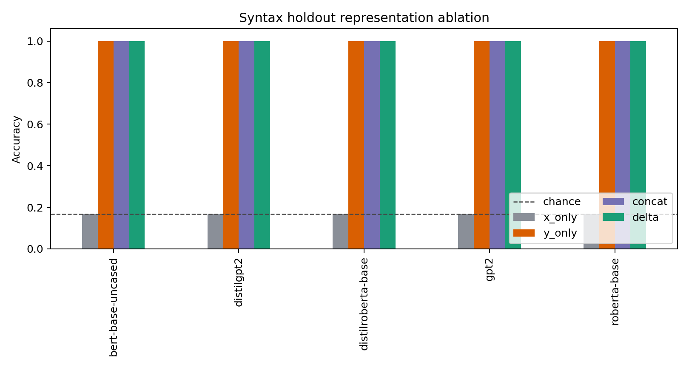

**Figure 1.** Syntax holdout representation ablation. The target endpoint alone solves the task, so this split is not evidence for transformation geometry.

Linear SVC syntax ablation:

| Model | x_only | y_only | concat | delta |
|---|---:|---:|---:|---:|
| BERT | `0.167` | `1.000` | `1.000` | `1.000` |
| RoBERTa | `0.167` | `1.000` | `1.000` | `1.000` |
| DistilRoBERTa | `0.167` | `1.000` | `1.000` | `1.000` |
| GPT-2 | `0.167` | `1.000` | `1.000` | `1.000` |
| DistilGPT-2 | `0.167` | `1.000` | `1.000` | `1.000` |

The full-semantic holdout remains more informative, but it is still vulnerable to target-side leakage. The correct interpretation is that these holdouts motivate stronger ablations rather than closing the question.

## 5. Delta Adds Reproducible Information Beyond Target-Only

The multiseed ablation is currently the strongest Track 1 evidence.

Source files:

- [ablation_multiseed_aggregated.csv](../../../results/ablation_multiseed_aggregated.csv)
- [reviewer_ablation_table.csv](../../../results/reviewer_ablation_table.csv)
- [ablation_multiseed_mcnemar.csv](../../../results/ablation_multiseed_mcnemar.csv)

Linear SVC, five seeds:

| Model | delta mean | y_only mean | concat mean | x_only mean | delta - y_only | delta - concat | max McNemar p |
|---|---:|---:|---:|---:|---:|---:|---:|
| BERT | `0.908` | `0.863` | `0.897` | `0.167` | `+0.044` | `+0.011` | `1.24e-09` |
| RoBERTa | `0.882` | `0.839` | `0.867` | `0.167` | `+0.043` | `+0.015` | `1.11e-16` |
| DistilRoBERTa | `0.881` | `0.831` | `0.842` | `0.167` | `+0.050` | `+0.039` | `<1e-15` |
| GPT-2 | `0.833` | `0.750` | `0.777` | `0.167` | `+0.084` | `+0.057` | `<1e-15` |
| DistilGPT-2 | `0.857` | `0.727` | `0.760` | `0.167` | `+0.131` | `+0.097` | `<1e-15` |

All seed-level McNemar tests for `delta` versus `y_only` are significant at `p < 0.001`.

This table changes the main claim:

1. `y_only` is strong, so endpoint leakage is real.
2. `delta` is stronger than `y_only` across all tested models.
3. `delta` is also stronger than `concat`, especially for decoder models.

The `concat < delta` effect is not a nuisance. It may be one of the most interesting findings: the difference vector may cancel content variation that remains entangled in the concatenated representation. This is especially plausible for GPT-style mean-pooled decoder embeddings, where mean pooling mixes early low-context token states with later contextualized states.

## 6. Geometric Structure of Delta Vectors

The PCA plot below projects delta vectors from the full semantic holdout setting.

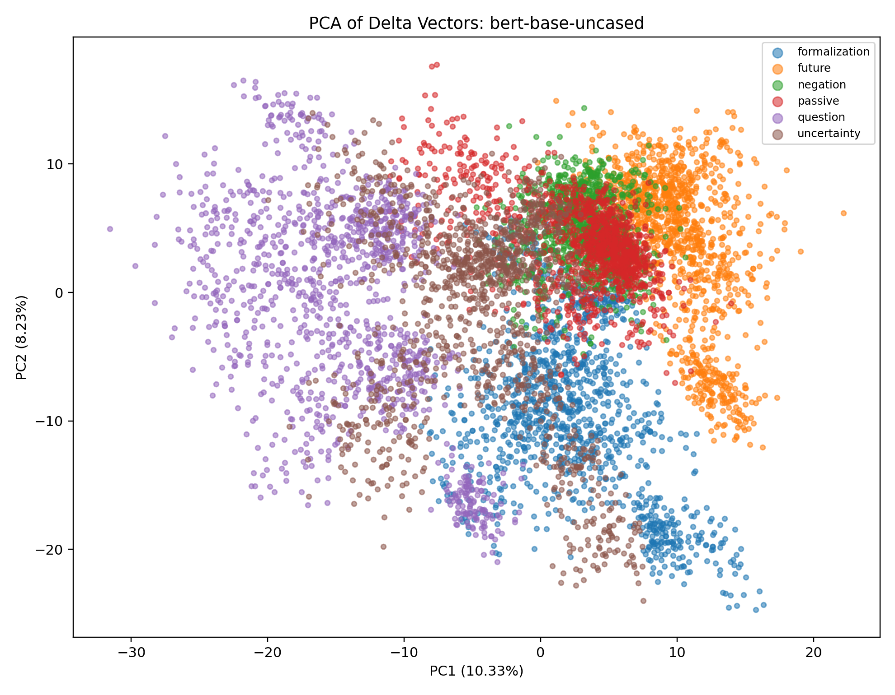

**Figure 3.** PCA projection of BERT delta vectors.

The explained variance plot shows that transformation information is distributed across multiple components rather than contained in a single scalar feature.

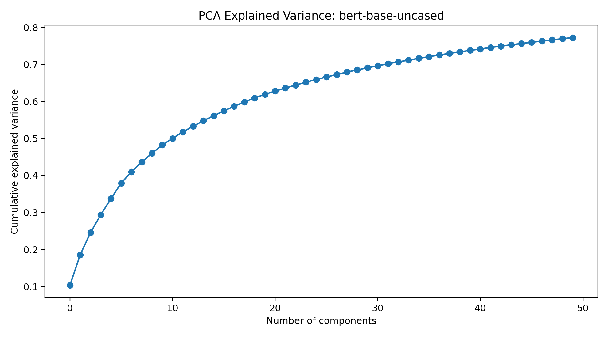

**Figure 4.** Cumulative explained variance for PCA on delta vectors.

These figures are illustrative. They should not be treated as proof without the ablation table above.

## 7. Separability and Class Stability

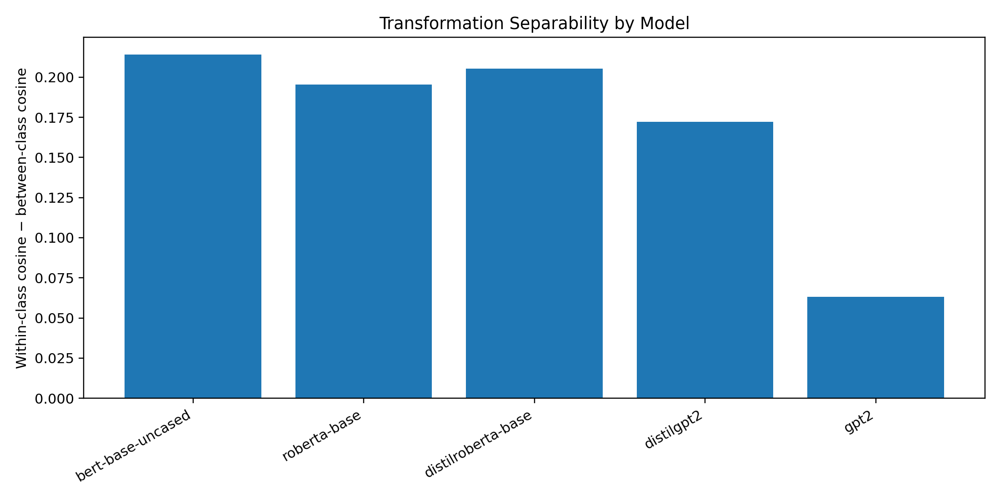

**Figure 5.** Transformation separability by model, measured from within-class versus between-class geometry.

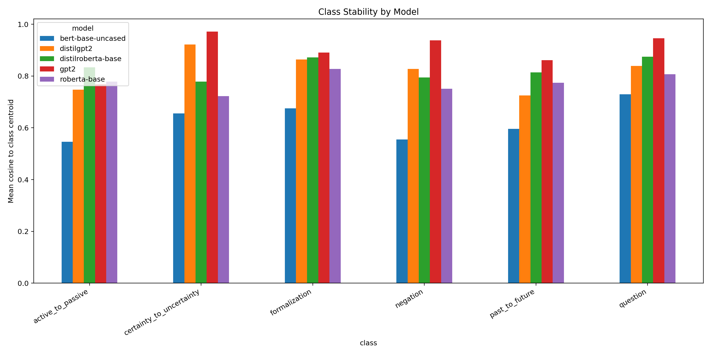

**Figure 6.** Mean cosine to class centroid across transformation classes and models.

These plots support the existence of class-structured delta geometry, but the next revision should connect them to error analysis and endpoint leakage controls.

## 8. Layerwise/Pooling Syntax Check

The syntax ablation was also repeated across BERT layers and pooling choices. The important result is not which late layer performs best; the important result is that the artifact already appears at the embedding layer. This is a red flag, not a positive result: layer `0` contains token and positional embeddings without contextual semantic processing, so perfect separability at this layer strongly suggests lexical/form cues.

Top rows include:

| Model | Layer | Pooling | Representation | Classifier | Accuracy |
|---|---:|---|---|---|---:|
| BERT | `0` | mean | delta | Linear SVC | `1.000` |
| BERT | `0` | mean | y_only | Linear SVC | `1.000` |
| BERT | `1` | mean | delta | Linear SVC | `1.000` |
| BERT | `1` | mean | y_only | Linear SVC | `1.000` |

This strengthens the reinterpretation: for the syntax split, the signal is available from token/form information before deep contextual composition is needed. It does not invalidate the full-semantic delta result, but it removes syntax holdout from the headline evidence and should be treated as a diagnostic failure of that split.

## 9. Full-Semantic Pooling Ablation

The full-semantic result was originally based on final-layer mean pooling. We now test mean, `[CLS]`, and last-token pooling on a reduced but still large full-semantic split (`N_BASE=150`, `n_train=1800`, `n_test=3600`) for BERT, RoBERTa, and GPT-2.

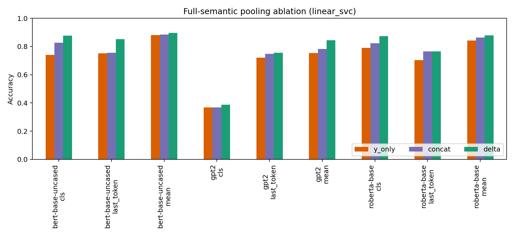

**Figure 7.** Full-semantic pooling ablation with Linear SVC.

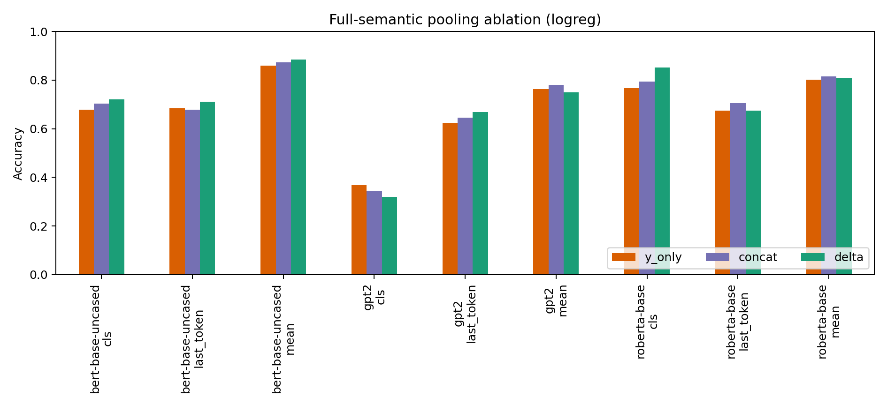

**Figure 8.** Full-semantic pooling ablation with logistic regression.

Key rows:

| Model | Pooling | Classifier | y_only | concat | delta |
|---|---|---|---:|---:|---:|
| BERT | mean | Linear SVC | `0.881` | `0.885` | `0.896` |
| BERT | `[CLS]` | Linear SVC | `0.740` | `0.827` | `0.878` |
| RoBERTa | mean | Linear SVC | `0.843` | `0.863` | `0.879` |
| RoBERTa | `[CLS]` | Linear SVC | `0.791` | `0.824` | `0.874` |
| GPT-2 | mean | Linear SVC | `0.754` | `0.782` | `0.845` |
| GPT-2 | last-token | Linear SVC | `0.720` | `0.747` | `0.756` |

Interpretation:

Mean pooling remains a defensible choice for the main full-semantic experiments. For BERT and RoBERTa, `[CLS]` also preserves a delta advantage but is usually weaker than mean pooling. For GPT-2, last-token pooling still gives `delta > y_only`, but the effect is smaller than with mean pooling; therefore the strong decoder row in the main table should be interpreted as partly pooling-dependent.

## 10. UPAT Hard-Holdout Boundary Result

The UPAT audit is a harder and smaller holdout (`n=80`, 5 classes) designed to reduce easy endpoint shortcuts. It does not support the broad statement that `delta` always beats `y_only`.

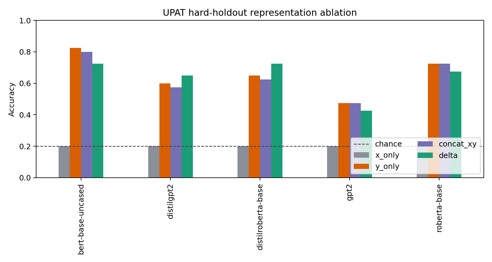

**Figure 9.** UPAT hard-holdout representation ablation.

| Model | delta | y_only | delta - y_only | McNemar p |
|---|---:|---:|---:|---:|
| BERT | `0.725` | `0.825` | `-0.100` | `0.289` |
| DistilRoBERTa | `0.725` | `0.650` | `+0.075` | `0.375` |
| RoBERTa | `0.675` | `0.725` | `-0.050` | `0.804` |
| GPT-2 | `0.425` | `0.475` | `-0.050` | `0.804` |
| DistilGPT-2 | `0.650` | `0.600` | `+0.050` | `0.727` |

No UPAT `delta` vs `y_only` comparison is significant at `p < 0.05`. This is now treated as a boundary condition:

> Delta vectors add information in the main full-semantic setting and in larger-model spot-checks, but the advantage is not guaranteed under small, hard holdout regimes where target endpoints remain strong and training capacity is limited.

This result should stay in the paper if UPAT remains in the package. Hiding it would create a worse reviewer problem than reporting it as a limitation.

Why UPAT differs from the main full-semantic dataset:

1. UPAT is much smaller, so the classifier has less data to estimate class directions.
2. UPAT is deliberately harder and reduces some of the repeated transformation markers that the main synthetic dataset still contains.
3. `y_only` remains strong, which means endpoint representations can still encode enough class information to beat or match `delta` under this regime.
4. The capacity curve shows strong train-size sensitivity, so the UPAT result should not be read as final disproof of delta geometry, but it does block any universal claim.

The correct interpretation is therefore not "`delta` is always the transformation representation." It is:

> Delta can add useful relational information, but endpoint-only features remain a serious confounder and can dominate under smaller, harder holdouts.

Exploratory UPAT notes:

The UPAT package also includes cross-model Procrustes alignment and shuffle controls. These are currently exploratory only. The reported Procrustes gains can be very large, and the current analysis lacks a random-label or random-pairing Procrustes null. Likewise, shuffle-control `p=0.0099` reflects the resolution limit of 100 permutations (`1 / 101`), not a precise p-value. Before any Procrustes or shuffle claim is promoted, the experiment needs at least 1000 permutations and an alignment null baseline.

## 11. Confusion and Negation Analysis

The reviewer hypothesis was that negation might be the bridge between Track 1 and Track 2. The full-semantic confusion matrices do not support that simple story.

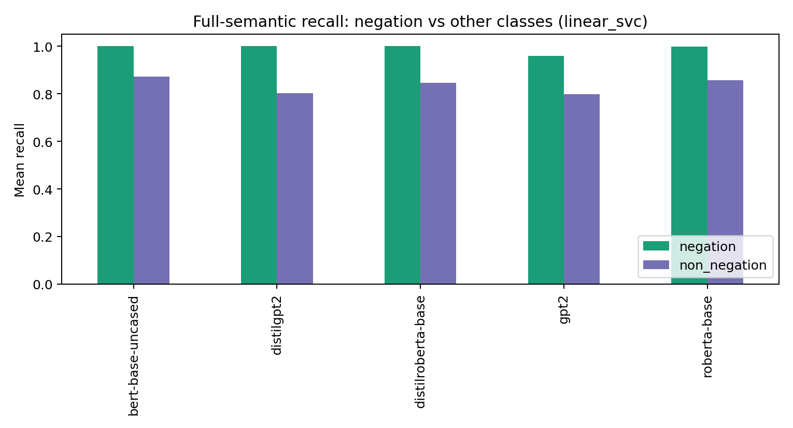

**Figure 10.** Negation versus non-negation recall for Linear SVC.

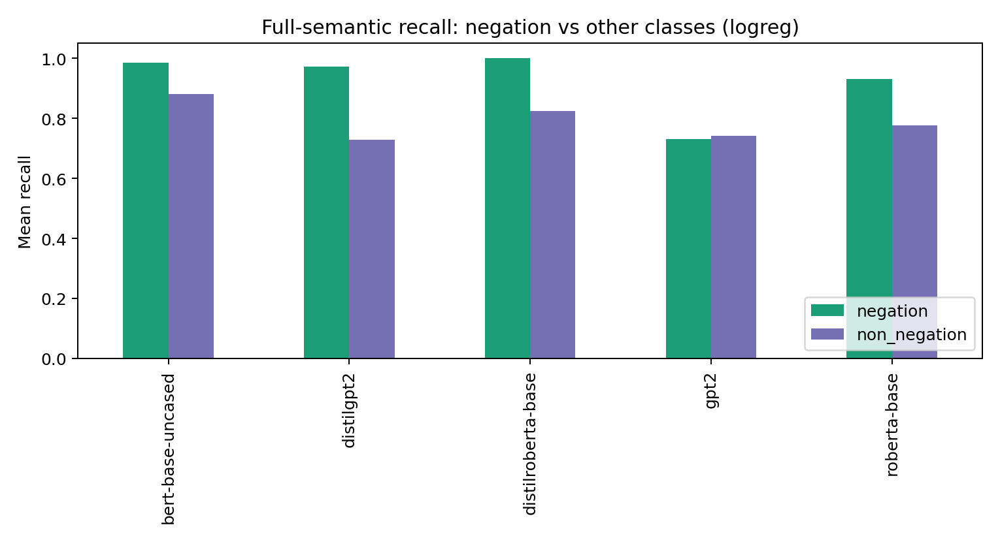

**Figure 11.** Negation versus non-negation recall for logistic regression.

Across full-semantic classifiers, negation is usually one of the easiest classes, often near perfect recall. The hardest class is typically `uncertainty`, not negation. This means the Track 2 negation failure is not explained by Track 1 being unable to classify single-step negation deltas. The more precise bridge is:

> Negation is easy as a surface-labeled one-step transformation, but unstable as a component of ordered third-order composition.

That distinction should become part of the final narrative.

## 12. Modern and Larger Model Spot-Checks

The first compact modern-architecture substitute was `microsoft/deberta-v3-small`.

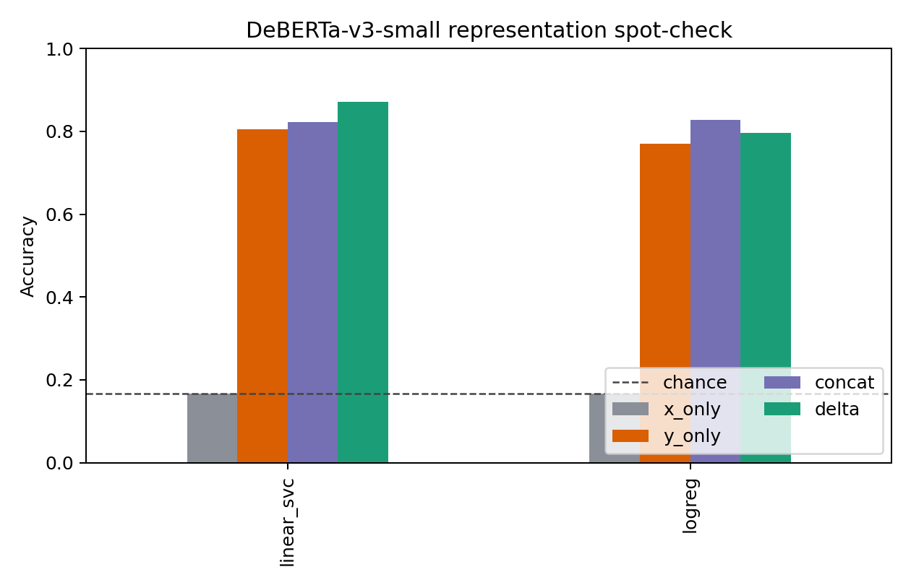

**Figure 12.** DeBERTa-v3-small representation spot-check.

| Classifier | x_only | y_only | concat | delta |
|---|---:|---:|---:|---:|
| Linear SVC | `0.167` | `0.804` | `0.823` | `0.871` |
| Logistic regression | `0.167` | `0.770` | `0.828` | `0.796` |

The Linear SVC result supports the main Track 1 claim on a model outside the original five: `delta` exceeds both `y_only` and `concat`. Logistic regression is mixed, with `concat` above `delta`, so the spot-check should be reported as supportive but not definitive.

After cleaning local caches, two stronger spot-checks were run: `bert-large-uncased` and `microsoft/deberta-v3-base`.

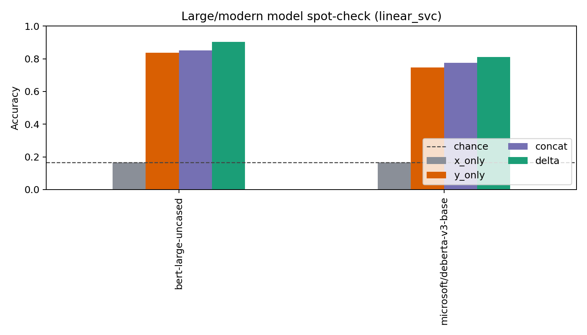

**Figure 13.** Larger/modern model spot-check with Linear SVC.

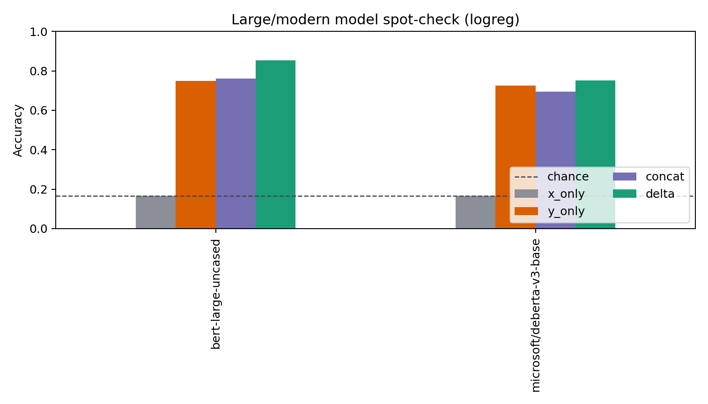

**Figure 14.** Larger/modern model spot-check with logistic regression.

| Model | Classifier | x_only | y_only | concat | delta |
|---|---|---:|---:|---:|---:|
| BERT-large | Linear SVC | `0.167` | `0.838` | `0.851` | `0.903` |
| BERT-large | Logistic regression | `0.167` | `0.750` | `0.760` | `0.854` |
| DeBERTa-v3-base | Linear SVC | `0.167` | `0.747` | `0.776` | `0.812` |
| DeBERTa-v3-base | Logistic regression | `0.167` | `0.726` | `0.694` | `0.752` |

These two spot-checks are stronger than the initial DeBERTa-v3-small run: `delta` is the best representation for both classifiers on both models. This does not replace full multiseed evaluation, but it removes the previous large-model blocker for the draft-level Track 1 claim.

## 13. Claim Supported by Current Evidence

Defensible claim:

> Delta vectors add reproducible transformation information beyond target-only endpoint representations in the main full-semantic setting and in larger-model spot-checks.

Not yet defensible:

> Delta vectors isolate pure linguistic operators independent of endpoint form.

The revised paper should center the first claim.

## 14. Current Limitations

- `syntax=1.0` is now confirmed to be target/surface-cue dominated in the current split.
- `y_only` is high, so target-side leakage is substantial.
- UPAT hard-holdout results do not show a significant `delta > y_only` advantage and sometimes favor `y_only`.
- The current core model set is small and old by 2026 standards, but draft-level spot-checks now include BERT-large and DeBERTa-v3-base.
- Mean pooling is now tested on a reduced full-semantic split, but the main multiseed table still uses only mean pooling.
- Related work positioning is started but still needs final ACL/EMNLP-quality bibliography formatting.

## 15. Required Pre-Submission Experiments

1. Produce `x_only/y_only/concat/delta` tables for every remaining holdout beyond syntax and full semantic.
2. Reconcile UPAT with the main full-semantic result by either expanding UPAT, matching train sizes, or clearly treating it as a hard negative control.
3. Convert the large/modern spot-check into a multiseed run if Track 1 becomes the submission priority.
4. Add confidence intervals for `delta - y_only` and `delta - concat`.
5. Add a final related-work section and bibliography in submission format.

## Current Status

This remains the more mature paper track, but the narrative has changed. The paper should be framed as a controlled ablation result about delta representations adding information beyond endpoints, not as a broad claim that all holdouts prove transformation geometry.
