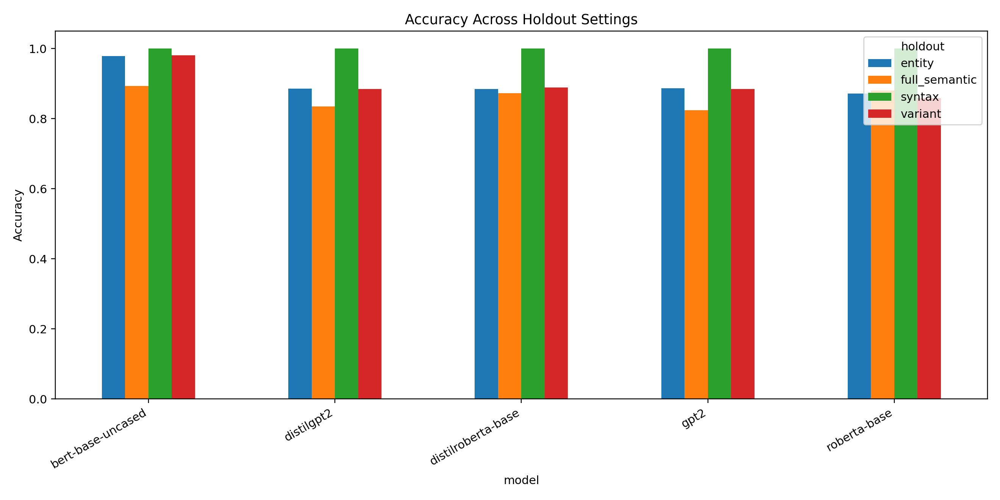

# Geometric Transformation Vectors in Transformer Embedding Spaces

## Abstract

Transformer embedding spaces encode relations between paired sentences, but the current evidence must be stated carefully. We study controlled linguistic transformations and represent each pair by `delta = embedding(target) - embedding(source)`. Across BERT, RoBERTa, DistilRoBERTa, GPT-2, and DistilGPT-2, delta representations outperform source-only and target-only baselines in the multiseed full-semantic setting, with McNemar tests significant for every seed/model pair. However, strong endpoint leakage remains: target-only representations are already highly predictive, and the `syntax=1.0` holdout result should be treated as a red flag for surface-form cues rather than as a central achievement. The defensible current claim is that delta vectors add reproducible transformation information beyond target endpoints, especially for decoder models, not that they isolate pure context-independent operators.

## Evidence Map

Main scripts:

- Figure generation: [make_paper_figures.py](../../../make_paper_figures.py)
- Full semantic holdout: [lie_llm_full_semantic_holdout_experiment.py](../../../lie_llm_full_semantic_holdout_experiment.py)
- Syntax holdout: [lie_llm_syntax_holdout_experiment.py](../../../lie_llm_syntax_holdout_experiment.py)
- Syntax representation ablation: [run_syntax_representation_ablation.py](../../../run_syntax_representation_ablation.py)
- Layerwise/pooling syntax ablation: [run_layerwise_pooling_ablation.py](../../../run_layerwise_pooling_ablation.py)
- Modern-model spot-check: [run_track1_spotcheck.py](../../../run_track1_spotcheck.py)
- Diverse dataset experiment: [lie_llm_diverse_dataset_experiment.py](../../../lie_llm_diverse_dataset_experiment.py)
- Entity holdout: [lie_llm_entity_holdout_experiment.py](../../../lie_llm_entity_holdout_experiment.py)
- Variant holdout: [lie_llm_variant_holdout_experiment.py](../../../lie_llm_variant_holdout_experiment.py)
- Multiseed ablation: [lie_llm_y_only_ablation_multiseed.py](../../../lie_llm_y_only_ablation_multiseed.py)

Main result files:

- Holdout summary table: [holdout_accuracy_comparison.csv](../../figures/holdout_accuracy_comparison.csv)
- Multiseed ablation summary: [ablation_multiseed_aggregated.csv](../../../results/ablation_multiseed_aggregated.csv)
- Reviewer ablation table: [reviewer_ablation_table.csv](../../../results/reviewer_ablation_table.csv)
- McNemar tests: [ablation_multiseed_mcnemar.csv](../../../results/ablation_multiseed_mcnemar.csv)
- Full semantic results: [full_semantic_holdout_summary.csv](../../../lie_llm_full_semantic_holdout_results/full_semantic_holdout_summary.csv)
- Syntax holdout results: [syntax_holdout_summary.csv](../../../lie_llm_syntax_results/syntax_holdout_summary.csv)
- Syntax representation ablation: [syntax_representation_ablation_pivot.csv](../../../syntax_representation_ablation_results/syntax_representation_ablation_pivot.csv)
- Layerwise/pooling syntax ablation: [layerwise_pooling_ablation_top20.csv](../../../layerwise_pooling_ablation_results/layerwise_pooling_ablation_top20.csv)
- DeBERTa-v3-small spot-check: [spotcheck_representation_ablation_pivot.csv](../../../track1_spotcheck_results/spotcheck_representation_ablation_pivot.csv)
- Large/modern spot-check: [spotcheck_representation_ablation_pivot.csv](../../../track1_spotcheck_large_results/spotcheck_representation_ablation_pivot.csv)
- Diverse separability: [ALL_separability.csv](../../../lie_llm_diverse_results/ALL_separability.csv)

## 1. Motivation

Most representation probes ask whether a sentence embedding contains a property such as tense, sentiment, or syntactic form. This work asks whether the difference between two related sentence embeddings contains the transformation that maps one sentence to the other.

For paired sentences `(x, y)`, we compute:

```text
delta = embedding(y) - embedding(x)
```

The key question is no longer "can delta classify transformation labels?" That is too easy if endpoints leak class information. The stronger question is:

> Does delta add reproducible information beyond target-only representations, and when is that advantage meaningful?

## 2. Related Work Positioning

This track is adjacent to several lines of work:

- task arithmetic: vector arithmetic over model/task updates
- function vectors: activation directions that induce in-context functions
- analogy probing: relational structure in embedding spaces
- attribute editing and representation steering

Our distinction is that we study sentence-pair displacement vectors for explicit linguistic transformations and compare `delta` against endpoint baselines. The final paper still needs a proper bibliography table. This is a pre-submission blocker, not optional polish.

## 3. Experimental Setup

For each paired sentence, embeddings are extracted from pretrained transformer models and pooled into a single vector. Classifiers are trained on:

- `x_only`: source embedding only
- `y_only`: target embedding only
- `concat`: concatenated source and target embeddings
- `delta`: target minus source embedding

Current pooling choice:

- mean pooling over final-layer token states

Reviewer-critical caveat:

Mean pooling is not yet justified. For encoder models, `[CLS]` pooling is a natural comparison. For decoder models, last-token pooling is a natural comparison because causal representations accumulate context at the final position. A pooling ablation is required before submission.

## 4. Holdout Results Are Evidence, But Not All Equally Strong

The current holdout comparison is generated by [make_paper_figures.py](../../../make_paper_figures.py).



**Figure 1.** Transformation classification accuracy across variant, entity, syntax, and full semantic holdout settings.

Key numbers:

| Holdout | Model | Accuracy |
|---|---|---:|
| syntax | all tested models | `1.000` |
| full semantic | BERT | `0.894` |
| full semantic | RoBERTa | `0.881` |
| full semantic | DistilRoBERTa | `0.873` |
| full semantic | GPT-2 | `0.824` |
| full semantic | DistilGPT-2 | `0.835` |
| entity | BERT | `0.979` |
| variant | BERT | `0.981` |

Interpretation after the reviewer-triggered ablation:

The syntax holdout result is not a headline result. The new syntax representation ablation shows that `y_only` reaches `1.000` with Linear SVC for every tested model, while `x_only` remains at chance (`0.167`). Therefore, the `syntax=1.0` result is best interpreted as target-side surface leakage: question marks, negation markers, tense markers, and other endpoint form cues are sufficient to solve the task.


**Figure 2.** Syntax holdout representation ablation. The target endpoint alone solves the task, so this split is not evidence for transformation geometry.

Linear SVC syntax ablation:

| Model | x_only | y_only | concat | delta |
|---|---:|---:|---:|---:|
| BERT | `0.167` | `1.000` | `1.000` | `1.000` |
| RoBERTa | `0.167` | `1.000` | `1.000` | `1.000` |
| DistilRoBERTa | `0.167` | `1.000` | `1.000` | `1.000` |
| GPT-2 | `0.167` | `1.000` | `1.000` | `1.000` |
| DistilGPT-2 | `0.167` | `1.000` | `1.000` | `1.000` |

The full-semantic holdout remains more informative, but it is still vulnerable to target-side leakage. The correct interpretation is that these holdouts motivate stronger ablations rather than closing the question.

## 5. Delta Adds Reproducible Information Beyond Target-Only

The multiseed ablation is currently the strongest Track 1 evidence.

Source files:

- [ablation_multiseed_aggregated.csv](../../../results/ablation_multiseed_aggregated.csv)
- [reviewer_ablation_table.csv](../../../results/reviewer_ablation_table.csv)
- [ablation_multiseed_mcnemar.csv](../../../results/ablation_multiseed_mcnemar.csv)

Linear SVC, five seeds:

| Model | delta mean | y_only mean | concat mean | x_only mean | delta - y_only | delta - concat | max McNemar p |
|---|---:|---:|---:|---:|---:|---:|---:|
| BERT | `0.908` | `0.863` | `0.897` | `0.167` | `+0.044` | `+0.011` | `1.24e-09` |
| RoBERTa | `0.882` | `0.839` | `0.867` | `0.167` | `+0.043` | `+0.015` | `1.11e-16` |
| DistilRoBERTa | `0.881` | `0.831` | `0.842` | `0.167` | `+0.050` | `+0.039` | `<1e-15` |
| GPT-2 | `0.833` | `0.750` | `0.777` | `0.167` | `+0.084` | `+0.057` | `<1e-15` |
| DistilGPT-2 | `0.857` | `0.727` | `0.760` | `0.167` | `+0.131` | `+0.097` | `<1e-15` |

All seed-level McNemar tests for `delta` versus `y_only` are significant at `p < 0.001`.

This table changes the main claim:

1. `y_only` is strong, so endpoint leakage is real.
2. `delta` is stronger than `y_only` across all tested models.
3. `delta` is also stronger than `concat`, especially for decoder models.

The `concat < delta` effect is not a nuisance. It may be one of the most interesting findings: the difference vector may cancel content variation that remains entangled in the concatenated representation. This is especially plausible for GPT-style mean-pooled decoder embeddings, where mean pooling mixes early low-context token states with later contextualized states.

## 6. Geometric Structure of Delta Vectors

The PCA plot below projects delta vectors from the full semantic holdout setting.


**Figure 3.** PCA projection of BERT delta vectors.

The explained variance plot shows that transformation information is distributed across multiple components rather than contained in a single scalar feature.


**Figure 4.** Cumulative explained variance for PCA on delta vectors.

These figures are illustrative. They should not be treated as proof without the ablation table above.

## 7. Separability and Class Stability


**Figure 5.** Transformation separability by model, measured from within-class versus between-class geometry.


**Figure 6.** Mean cosine to class centroid across transformation classes and models.

These plots support the existence of class-structured delta geometry, but the next revision should connect them to error analysis and endpoint leakage controls.

## 8. Layerwise/Pooling Syntax Check

The syntax ablation was also repeated across BERT layers and pooling choices. The important result is not which late layer performs best; the important result is that the artifact already appears at the embedding layer.

Top rows include:

| Model | Layer | Pooling | Representation | Classifier | Accuracy |
|---|---:|---|---|---|---:|
| BERT | `0` | mean | delta | Linear SVC | `1.000` |
| BERT | `0` | mean | y_only | Linear SVC | `1.000` |
| BERT | `1` | mean | delta | Linear SVC | `1.000` |
| BERT | `1` | mean | y_only | Linear SVC | `1.000` |

This strengthens the reinterpretation: for the syntax split, the signal is available from token/form information before deep contextual composition is needed. It does not invalidate the full-semantic delta result, but it removes syntax holdout from the headline evidence.

## 9. Modern and Larger Model Spot-Checks

The first compact modern-architecture substitute was `microsoft/deberta-v3-small`.


**Figure 7.** DeBERTa-v3-small representation spot-check.

| Classifier | x_only | y_only | concat | delta |
|---|---:|---:|---:|---:|
| Linear SVC | `0.167` | `0.804` | `0.823` | `0.871` |
| Logistic regression | `0.167` | `0.770` | `0.828` | `0.796` |

The Linear SVC result supports the main Track 1 claim on a model outside the original five: `delta` exceeds both `y_only` and `concat`. Logistic regression is mixed, with `concat` above `delta`, so the spot-check should be reported as supportive but not definitive.

After cleaning local caches, two stronger spot-checks were run: `bert-large-uncased` and `microsoft/deberta-v3-base`.


**Figure 8.** Larger/modern model spot-check with Linear SVC.


**Figure 9.** Larger/modern model spot-check with logistic regression.

| Model | Classifier | x_only | y_only | concat | delta |
|---|---|---:|---:|---:|---:|
| BERT-large | Linear SVC | `0.167` | `0.838` | `0.851` | `0.903` |
| BERT-large | Logistic regression | `0.167` | `0.750` | `0.760` | `0.854` |
| DeBERTa-v3-base | Linear SVC | `0.167` | `0.747` | `0.776` | `0.812` |
| DeBERTa-v3-base | Logistic regression | `0.167` | `0.726` | `0.694` | `0.752` |

These two spot-checks are stronger than the initial DeBERTa-v3-small run: `delta` is the best representation for both classifiers on both models. This does not replace full multiseed evaluation, but it removes the previous large-model blocker for the draft-level Track 1 claim.

## 10. Claim Supported by Current Evidence

Defensible claim:

> Delta vectors add reproducible transformation information beyond target-only endpoint representations across multiple small transformer models.

Not yet defensible:

> Delta vectors isolate pure linguistic operators independent of endpoint form.

The revised paper should center the first claim.

## 11. Current Limitations

- `syntax=1.0` is now confirmed to be target/surface-cue dominated in the current split.
- `y_only` is high, so target-side leakage is substantial.
- The current core model set is small and old by 2026 standards, but draft-level spot-checks now include BERT-large and DeBERTa-v3-base.
- Mean pooling is not fully justified for the main full-semantic experiments against `[CLS]` and last-token alternatives.
- There is no full error analysis of confusion matrices yet.
- Related work positioning is currently incomplete.

## 12. Required Pre-Submission Experiments

1. Produce `x_only/y_only/concat/delta` tables for every remaining holdout beyond syntax and full semantic.
2. Add full-semantic pooling ablation:
   - encoder `[CLS]` vs mean pooling
   - decoder last-token vs mean pooling
3. Convert the large/modern spot-check into a multiseed run if Track 1 becomes the submission priority.
4. Add confidence intervals for `delta - y_only` and `delta - concat`.
5. Add confusion-matrix error analysis:
   - which transformations are confused?
   - does negation behave differently?
6. Add a proper related-work section and bibliography.

## Current Status

This remains the more mature paper track, but the narrative has changed. The paper should be framed as a controlled ablation result about delta representations adding information beyond endpoints, not as a broad claim that all holdouts prove transformation geometry.
