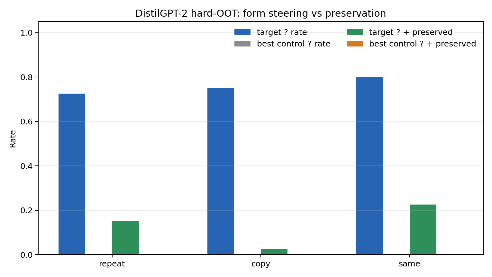
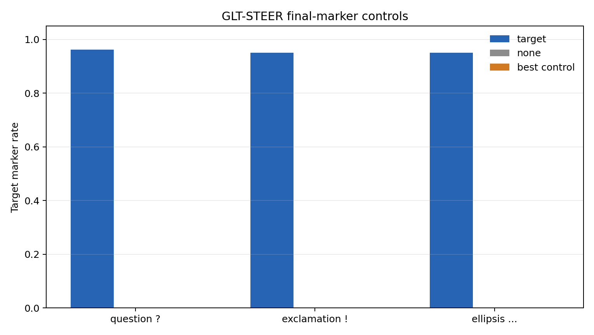
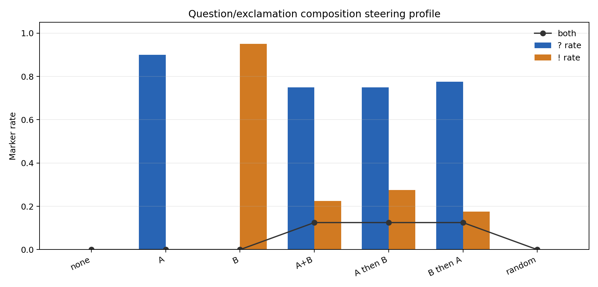

# GLT-STEER: Transformation Vectors as Activation-Space Editors

Status: short draft, not peer reviewed.

## Abstract

This draft tests whether transformation vectors learned from sentence-pair hidden-state differences can be injected back into a generative transformer as activation-space editors. In GPT-2, a question-transformation vector injected into early residual-stream layers reliably induces question-form outputs under matched controls. The strongest copy-prompt setting reaches question-and-preserved rates up to `0.975` on simple held-out sources, while no-steering, random-norm, wrong-class, and negative-vector controls remain at `0.000` in matched headline rows. Hard out-of-template sources preserve the question-marker effect but reduce content preservation. DistilGPT-2 replicates the effect only after layer/gain tuning and remains weaker under hard out-of-template content preservation. Non-question tests show an important boundary: sentence-internal negation is not cleanly steered by the current recipe, while final surface markers such as `?`, `!`, and `...` are much easier to edit. A first question/exclamation composition test shows nonlinear interaction between marker vectors, but does not establish a Lie algebra.

## 1. Question

The representation-track result asks whether sentence-pair deltas classify transformation type:

```text
delta = h(target sentence) - h(source sentence)
```

GLT-STEER asks a stronger intervention question:

```text
If a transformation delta is injected during generation, does the model produce the corresponding transformation?
```

This is a behavior-level test. It is not enough for a formal algebraic claim, but it is stronger than offline separability because the vector is used causally inside a running model.

## 2. Method

The core recipe is:

1. Build synthetic source/target sentence pairs for a transformation class.
2. Extract GPT-style hidden states at selected transformer blocks.
3. Compute a centroid transformation vector from training pairs.
4. During generation, add the vector to the last prompt token at a chosen residual block.
5. Compare target steering against no-steering, wrong-class, random-norm, and negative-vector controls.

Primary implementation files:

- `../../../scripts/run_gpt2_activation_steering_pilot.py`
- `../../../scripts/run_gpt2_question_steering_controls.py`
- `../../../scripts/run_gpt2_transformation_copy_prompt_steering.py`
- `../../../scripts/run_gpt2_exclamation_copy_prompt_steering.py`
- `../../../scripts/run_gpt2_final_marker_copy_prompt_steering.py`
- `../../../scripts/run_gpt2_marker_composition_steering.py`

The basic intervention hook adds the learned vector to the last token hidden state inside a transformer block. The current implementation is intentionally simple: no learned controller, no prompt-specific optimization, and no gradient update at generation time.

## 3. Main Question-Steering Result

The focused GPT-2 question run completed `6800` generations with no failures.

Key result:

| condition | question mark rate |
|---|---:|
| target question vector | `0.9350` |
| random-norm control | `0.0000` |
| wrong-class control | `0.0000` |
| negative-target control | `0.0000` |

Result folder:

- `../../../results/experiments/gpt2_question_activation_steering_focused_20260714_results/`

The prompt-only concern was tested explicitly. Copy-like prompts without steering produce `0.0000` question marks across `960` no-steering rows from GPT-2 and DistilGPT-2.

Result folder:

- `../../../results/experiments/question_copy_prompt_none_baseline_20260716_results/`

## 4. Content Preservation

Question marks alone are not enough: the model could simply emit question-like fragments while losing the source sentence. The copy-prompt preservation audit tests whether the output both contains a question marker and preserves source content.

Headline GPT-2 result:

| source set | prompt family | target question-and-preserved |
|---|---|---:|
| in-template | copy-like prompts | `0.9625-0.9750` |
| simple out-of-template | copy-like prompts | `0.8250-0.9000` |

Result folder:

- `../../../results/experiments/gpt2_question_copy_prompt_preservation_20260716_results/`

Interpretation:

The result is stronger than punctuation insertion, but still prompt-conditioned. The cleanest behavior appears when the prompt already asks the model to repeat or copy the source sentence.

## 5. Hard Out-of-Template Generalization

A hard out-of-template audit used structurally diverse sentences with passive clauses, subordinate clauses, proper names, and numeric/time expressions.

GPT-2:

| prompt style | target question mark | best matched control | strict question-and-preserved |
|---|---:|---:|---:|
| `repeat_sentence` | `0.7125` | `0.0375` | lower than simple OOT |
| `copy_sentence` | `0.7500` | `0.0375` | lower than simple OOT |
| `same_sentence` | `0.7500` | `0.0375` | `0.5125` |

Result folder:

- `../../../results/experiments/gpt2_question_hard_oot_copy_prompt_steering_20260716_results/`

DistilGPT-2, tuned setting (`layer=2`, `gain=1.0`):

| prompt style | target question mark | best matched control question mark | strict question-and-preserved |
|---|---:|---:|---:|
| `repeat_sentence` | `0.725` | `0.000` | `0.150` |
| `copy_sentence` | `0.750` | `0.000` | `0.025` |
| `same_sentence` | `0.800` | `0.000` | `0.225` |

Result folder:

- `../../../results/experiments/distilgpt2_question_hard_oot_best_layer2_gain10_20260801_results/`

Figure:



Interpretation:

The hard-OOT result separates form steering from semantic editing. DistilGPT-2 preserves the marker effect cleanly, but content preservation is much weaker than in GPT-2 and much weaker than in the simple out-of-template setting.

## 6. Why Negation Fails Under This Recipe

The first non-question extension to negation is weak/negative under copy-like prompts.

Result folders:

- `../../../results/experiments/gpt2_negation_copy_prompt_steering_20260716_results/`
- `../../../results/experiments/gpt2_negation_copy_prompt_layer_sweep_20260716_results/`

The best negation target-and-preserved row in the layer sweep reaches only `0.1729`, while controls remain nontrivial, with maxima up to `0.1229`.

A delta-coherence diagnostic explains part of this boundary:

| layer | question mean pairwise cosine | negation mean pairwise cosine |
|---:|---:|---:|
| `2` | `0.9693` | `0.5621` |
| `3` | `0.9365` | `0.5665` |

Result folder:

- `../../../results/experiments/gpt2_steering_delta_coherence_20260716_results/`

Interpretation:

Question deltas are much more internally coherent than negation deltas. In addition, question formation has a final surface marker (`?`) that an autoregressive model can append at the end of generation, while negation often requires inserting or restructuring sentence-internal tokens such as `not`, `never`, or auxiliary forms.

## 7. Final-Marker Controls

To test whether the question result is question-specific or part of a broader final-marker phenomenon, we ran final-marker controls.

Figure:



Exclamation:

| source set | exclamation-and-preserved |
|---|---:|
| in-template | `1.0000` |
| hard out-of-template | `0.8000` |

Result folder:

- `../../../results/experiments/gpt2_exclamation_copy_prompt_steering_20260716_results/`

Ellipsis:

| prompt style | target ellipsis rate | ellipsis-and-preserved | best non-target ellipsis rate |
|---|---:|---:|---:|
| `repeat_sentence` | `0.925` | `0.525` | `0.000` |
| `copy_sentence` | `0.925` | `0.475` | `0.000` |
| `same_sentence` | `0.950` | `0.575` | `0.000` |

Result folder:

- `../../../results/experiments/gpt2_ellipsis_hard_oot_layer2_20260801_results/`

Interpretation:

The question result is not isolated. Final surface markers are particularly steerable. This strengthens the intervention result while narrowing its interpretation: current GLT-STEER works best for output-form edits, not arbitrary semantic rewrites.

## 8. Marker Composition

The first composition steering test compares:

```text
A = question vector
B = exclamation vector
A+B = vector sum at one layer
A then B = A at layer 2, B at layer 3
B then A = B at layer 2, A at layer 3
```

Result folder:

- `../../../results/experiments/gpt2_question_exclamation_marker_composition_layer2_3_20260801_results/`

Same-sentence prompt summary:

| control | question rate | exclamation rate | both-marker rate | preserved rate |
|---|---:|---:|---:|---:|
| `none` | `0.000` | `0.000` | `0.000` | `0.800` |
| `A only` | `0.900` | `0.000` | `0.000` | `0.750` |
| `B only` | `0.000` | `0.950` | `0.000` | `0.800` |
| `A+B` | `0.750` | `0.225` | `0.125` | `0.450` |
| `A then B` | `0.750` | `0.275` | `0.125` | `0.450` |
| `B then A` | `0.775` | `0.175` | `0.125` | `0.475` |
| `random sum` | `0.000` | `0.000` | `0.000` | `0.575` |

Order contrast:

| prompt style | exact `AB == BA` | marker profile `AB == BA` | `AB == A+B` | `BA == A+B` |
|---|---:|---:|---:|---:|
| `copy_sentence` | `0.200` | `0.650` | `0.150` | `0.200` |
| `repeat_sentence` | `0.300` | `0.725` | `0.150` | `0.225` |
| `same_sentence` | `0.200` | `0.650` | `0.100` | `0.150` |

Figure:



Interpretation:

The single vectors behave cleanly and the random-sum control produces no target markers. The summed and ordered interventions produce mixed marker profiles and lower content preservation. Exact generated text is order-sensitive, but marker-level profiles are much closer.

This is useful evidence of nonlinear causal interaction between steering vectors. It is not evidence for a Lie algebra. A stronger algebraic intervention test would need transformations that can genuinely co-occur without competing for the same final punctuation slot.

## 9. Current Claim

The defensible current claim is:

> Transformation deltas learned from hidden-state differences can act as activation-space editors for some output-form transformations in GPT-2. The effect is strongest for final surface markers, survives several no-steering and vector controls, and shows partial out-of-template generalization. It is transformation-dependent, model-dependent, and not yet a general semantic editing method.

## 10. What Is Not Claimed

This draft does not claim:

- that GLT-STEER solves semantic rewriting;
- that negation can be steered cleanly by the current method;
- that final-marker steering proves general linguistic transformation editing;
- that the composition test proves noncommutative algebra;
- that the result establishes a Lie algebra in transformer activations;
- that prompt wording is irrelevant.

## 11. Next Experiments

The highest-value next steps are:

1. Redesign non-final-marker steering before making stronger composition claims. A first `question + modality` run shows that the question vector remains strong, but the current modality vector produces no evidential markers under copy-like hard out-of-template prompts.
2. Test transformations that can co-occur without occupying the same final punctuation slot and that have stronger output markers than the current modality recipe, such as question plus politeness marker or emphasis plus question.
3. Move from single last-token injection to multi-token or token-position-aware intervention for sentence-internal transformations such as negation and modality.
4. Repeat the final-marker and composition tests on a second model family with layer/gain tuning.
5. Add bootstrap confidence intervals over sources and prompt styles.
6. For a Lie-style intervention track, define transformations whose composition has a clear expected target string and compare `AB`, `BA`, and `A+B` against that target rather than only marker profiles.
