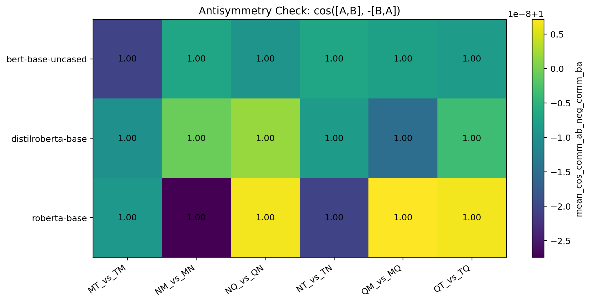

# Third-Order Signed Permutation Coherence for Linguistic Transformations in Transformer Embedding Spaces

## Abstract

If linguistic transformations are recoverable as displacement vectors, the next question is whether they compose in structured ways. We test controlled transformations corresponding to negation (`N`), question formation (`Q`), modality/evidentiality (`M`), and tense (`T`). Ordered compositions differ in embedding space, and semantic-equivalence controls show statistically significant but distributionally broad separation between equivalent and non-equivalent pairs. For third-order compositions, we no longer describe the main test as a Jacobi identity. Instead, we evaluate a neutral diagnostic: third-order signed permutation coherence, defined by the alternating endpoint sum `ABC+BCA+CAB-ACB-CBA-BAC` and compared against permutation-null baselines with bootstrap intervals. The strongest current result is local: `QMT` shows robust below-null cancellation across BERT, DistilRoBERTa, and RoBERTa, while negation-containing triples are mixed or worse than null. The evidence supports a local signed-permutation coherence effect, not a global Lie algebra.

## Evidence Map

Main scripts:

- Composition audit: [run_lie_composition_audit.py](../../../run_lie_composition_audit.py)
- Semantic equivalence control: [run_lie_semantic_equivalence_control.py](../../../run_lie_semantic_equivalence_control.py)
- Algebraic-identity audit / signed permutation diagnostic: [run_lie_algebraic_identities.py](../../../run_lie_algebraic_identities.py)
- Composition dataset helper: [lie_composition_dataset.py](../../../lie_composition_dataset.py)

Main result files:

- Composition summary: [lie_composition_summary.csv](../../../lie_composition_results/csv/lie_composition_summary.csv)
- Semantic equivalence summary: [semantic_equivalence_summary.csv](../../../lie_semantic_equivalence_results/csv/semantic_equivalence_summary.csv)
- Semantic statistical tests: [semantic_equivalence_tests.csv](../../../lie_semantic_equivalence_results/csv/semantic_equivalence_tests.csv)
- Semantic effect sizes: [reviewer_semantic_effect_sizes.csv](../../../lie_semantic_equivalence_results/csv/reviewer_semantic_effect_sizes.csv)
- Antisymmetry summary: [antisymmetry_summary.csv](../../../lie_algebraic_identities_results/csv/antisymmetry_summary.csv)
- Signed permutation summary: [jacobi_summary.csv](../../../lie_algebraic_identities_results/csv/jacobi_summary.csv)
- Signed permutation raw rows: [jacobi_raw_all_models.csv](../../../lie_algebraic_identities_results/csv/jacobi_raw_all_models.csv)
- Dataset audit: [reviewer_dataset_audit.csv](../../../lie_algebraic_identities_results/csv/reviewer_dataset_audit.csv)
- Decoder signed permutation summary: [jacobi_summary.csv](../../../lie_algebraic_identities_decoder_results/csv/jacobi_summary.csv)

Daily verification packet:

- [2026-06-12_reviewer_revised_report.pdf](../../../reports/2026-06-12_reviewer_revised_report.pdf)

## 1. Motivation

The geometric transformation-vector paper shows that delta vectors add information beyond endpoints. This paper asks a stricter question:

> Do linguistic transformations compose in a way that reveals structured operator-like behavior?

The answer is currently partial. Pairwise composition shows order effects. Third-order signed permutation tests show one robust local effect (`QMT`) and several failures involving negation.

## 2. Related Work Positioning

This track needs to be positioned against:

- task arithmetic
- function vectors
- representation steering
- analogy and relation-vector probing
- prior work on negation failures in transformer representations

The distinguishing feature is not merely vector arithmetic, but explicit testing of ordered linguistic composition endpoints and null-controlled signed permutation cancellation. A complete bibliography remains required before submission.

## 3. Operations and Models

Current operations:

| Symbol | Operation |
|---|---|
| `N` | negation |
| `Q` | question formation |
| `M` | modality/evidentiality via allegedness |
| `T` | tense/future temporal shift |

Current encoder models:

- `bert-base-uncased`
- `distilroberta-base`
- `roberta-base`

Decoder replication now added:

- `gpt2`
- `distilgpt2`

Reviewer-critical caveat:

The decoder replication supports the local `QMT` result, but negation-containing triples become more model-dependent. This strengthens the paper's narrowed framing: local signed-permutation coherence exists, but it is not a general operator algebra.

## 4. Composition and Noncommutativity

The first test compares ordered compositions `AB` and `BA`.


**Figure 1.** Noncommutativity heatmap for ordered operation pairs.


**Figure 2.** Relative commutator norm across operation pairs and models.

Observation:

Order matters, especially for transformations involving tense. This is necessary but not sufficient evidence for operator structure, because template wording alone could create order-sensitive embeddings.

## 5. Semantic Equivalence Control

The semantic equivalence control compares pairs intended to preserve meaning against pairs where order should change meaning.


**Figure 3.** Equivalent pairs have lower mean noncommutativity, but distributions are broad.

Summary and tests:

| Model | Equivalent mean | Non-equivalent mean | Difference | Cohen d | Welch p | Mann-Whitney p |
|---|---:|---:|---:|---:|---:|---:|
| BERT | `0.113` | `0.329` | `0.216` | `2.53` | `2.21e-140` | `4.92e-131` |
| DistilRoBERTa | `0.129` | `0.232` | `0.102` | `2.35` | `2.17e-150` | `4.96e-117` |
| RoBERTa | `0.154` | `0.278` | `0.124` | `2.29` | `9.19e-142` | `5.07e-103` |

Interpretation:

The difference is statistically strong. But the control should not be oversold as a clean separation: the standard deviations are substantial and distributions overlap. The correct claim is that semantic-equivalence labels shift the distribution of noncommutativity, not that they perfectly separate pair types.

## 6. Antisymmetry Is a Sanity Check

The antisymmetry check asks whether:

```text
[A,B] ~= -[B,A]
```

The result is essentially perfect, but this follows from the implementation. We keep the figure as a sanity check only.



**Figure 4.** Antisymmetry sanity check.

## 7. Third-Order Signed Permutation Coherence

We avoid calling the main third-order test a Jacobi identity. The Lie-algebra Jacobi identity is:

```text
[A,[B,C]] + [B,[C,A]] + [C,[A,B]] = 0
```

Our endpoint-based diagnostic is different:

```text
S(A,B,C) = ABC + BCA + CAB - ACB - CBA - BAC
```

This is a signed alternating sum over six composition endpoints. It tests whether cyclic orderings and anti-cyclic orderings occupy a coherent signed geometry in embedding space. It is related in spirit to antisymmetric third-order structure, but it is not a formal Jacobi identity.

Metrics:

```text
relative_signed_permutation_norm = ||S|| / scale
signed_permutation_to_null_ratio = observed relative norm / permutation-null mean
```

The CSV still uses historical column names such as `relative_jacobi_norm` and `jacobi_to_null_mean_ratio`; these should be renamed in code before submission.

Controls:

- 1000 permutation-null samples per row
- 2000 bootstrap resamples for confidence intervals
- all four triples from `N,Q,M,T`: `NQM`, `NQT`, `NMT`, `QMT`
- endpoint audit: no duplicate endpoints in any row

Dataset audit:

| Triple | Rows | Unique sources | Unique endpoint texts | Duplicate endpoint rows |
|---|---:|---:|---:|---:|
| `NMT` | 100 | 100 | 600 | 0 |
| `NQM` | 100 | 100 | 600 | 0 |
| `NQT` | 100 | 100 | 600 | 0 |
| `QMT` | 100 | 100 | 600 | 0 |


**Figure 5.** Relative norm of the third-order signed permutation sum.


**Figure 6.** Ratio of observed signed permutation norm to permutation-null mean. Values below `1.0` indicate stronger-than-null cancellation.


**Figure 7.** Decoder-model replication for the signed permutation ratio to permutation-null mean.

## 8. Main Third-Order Result

The robust below-null result is `QMT`.

| Model | Triple | Ratio to null | 95% CI |
|---|---|---:|---:|
| BERT | `QMT` | `0.683` | `[0.677, 0.689]` |
| DistilRoBERTa | `QMT` | `0.631` | `[0.627, 0.636]` |
| RoBERTa | `QMT` | `0.623` | `[0.617, 0.629]` |
| GPT-2 | `QMT` | `0.539` | `[0.519, 0.561]` |
| DistilGPT-2 | `QMT` | `0.771` | `[0.745, 0.797]` |

Negative or mixed cases:

| Model | Triple | Ratio to null | Interpretation |
|---|---|---:|---|
| BERT | `NQT` | `1.117` | worse than null |
| DistilRoBERTa | `NMT` | `1.134` | worse than null |
| RoBERTa | `NMT` | `1.253` | worse than null |
| RoBERTa | `NQM` | `0.980` | near null |
| GPT-2 | `NMT` | `1.335` | worse than null |
| GPT-2 | `NQM` | `1.195` | worse than null |
| DistilGPT-2 | `NQT` | `1.420` | worse than null |

The central claim is now narrower:

> `QMT` shows stable third-order signed permutation cancellation stronger than null across tested encoder models and the two decoder spot-checks.

## 9. Negation Is a Result, Not Just a Limitation

Negation-containing triples are where the structure breaks most clearly. This should be interpreted as a substantive finding.

Working hypothesis:

Negation may not behave like a smooth linear direction in these embedding spaces. It can interact with scope, syntax, and surface markers in ways that make endpoint geometry less coherent. This aligns with the broader concern that transformer representations often handle negation less robustly than positive factual content.

Immediate follow-up:

- isolate negation-only transformations in Track 1 confusion analysis
- compare `N` pairwise commutators against non-`N` pairwise commutators
- generate paraphrases where negation markers are less lexically obvious
- test whether middle layers represent negation more coherently than final layers

Decoder replication sharpens this point. GPT-2 shows strong `QMT` cancellation (`0.539`) but fails on `NMT` and `NQM`; DistilGPT-2 keeps `NMT` and `NQM` below null but fails badly on `NQT`. The important fact is not merely that negation is hard, but that negation changes the algebraic diagnostic differently across architectures.

## 10. What This Evidence Does and Does Not Prove

Evidence layers:

1. Pairwise composition gives noncommutativity.
2. Semantic controls show a statistically significant distribution shift.
3. Signed permutation coherence identifies one robust local third-order effect.
4. Negation triples mostly fail, which constrains the theory.

Not proven:

- global Lie algebra
- formal Jacobi identity
- model-independent operator calculus
- robustness to grammar-generated templates
- broad decoder-model generality beyond the two spot-checks

## 11. Required Pre-Submission Experiments

1. Rename code/CSV columns away from `jacobi_*` toward `signed_permutation_*`.
2. Re-run with grammar-generated templates.
3. Add endpoint-only / target-only controls for composition endpoints.
4. Add layerwise analysis.
5. Add pooling ablation.
6. Add a focused negation analysis before adding new operators.
7. Add prior-work positioning and bibliography.

## Current Status

This is a promising diagnostic study, but it is not submission-ready. The current result is useful precisely because it is local and falsifiable: `QMT` survives current controls, while negation-heavy triples expose the boundary of the phenomenon.
