# GLT-SPOT: Third-Order Signed Permutation Coherence for Linguistic Transformations in Transformer Embedding Spaces

## Abstract

If linguistic transformations are recoverable as displacement vectors, the next question is whether they compose in structured ways. We introduce **GLT-SPOT**, the **Geometric Linguistic Transformations Signed-Permutation Operator Test**, for probing controlled transformations corresponding to negation (`N`), question formation (`Q`), modality/evidentiality (`M`), and tense (`T`). Ordered compositions differ in embedding space, and semantic-equivalence controls show statistically significant but distributionally broad separation between equivalent and non-equivalent pairs. For third-order compositions, we no longer describe the main test as a Jacobi identity. Instead, GLT-SPOT evaluates a neutral diagnostic: third-order signed permutation coherence, defined by the alternating endpoint sum `ABC+BCA+CAB-ACB-CBA-BAC` and compared against permutation-null baselines with bootstrap intervals. The original English encoder/decoder table singled out `QMT` as the only triple stable across all five tested models. The 2026-06-23 multilingual max audit changes the story: across 7 languages and 5 multilingual encoders, all four tested triples are below signed-null in every model-language cell, with `NQM` and `QMT` strongest. The evidence supports a controlled signed-permutation coherence effect, not a global Lie algebra.

## Evidence Map

Main scripts:

- Composition audit: [run_lie_composition_audit.py](../../../scripts/run_lie_composition_audit.py)
- Semantic equivalence control: [run_lie_semantic_equivalence_control.py](../../../scripts/run_lie_semantic_equivalence_control.py)
- Algebraic-identity audit / signed permutation diagnostic: [run_lie_algebraic_identities.py](../../../scripts/run_lie_algebraic_identities.py)
- Multilingual max audit: [run_lie_multilingual_max_audit.py](../../../scripts/run_lie_multilingual_max_audit.py)
- Structure-constants / closure audit: [run_lie_structure_constants_audit.py](../../../scripts/run_lie_structure_constants_audit.py)
- Composition dataset helper: [lie_composition_dataset.py](../../../scripts/lie_composition_dataset.py)

Main result files:

- Composition summary: [lie_composition_summary.csv](../../../results/experiments/lie_composition_results/csv/lie_composition_summary.csv)
- Decoder composition summary: [lie_composition_summary.csv](../../../results/experiments/lie_composition_decoder_results/csv/lie_composition_summary.csv)
- Semantic equivalence summary: [semantic_equivalence_summary.csv](../../../results/experiments/lie_semantic_equivalence_results/csv/semantic_equivalence_summary.csv)
- Semantic statistical tests: [semantic_equivalence_tests.csv](../../../results/experiments/lie_semantic_equivalence_results/csv/semantic_equivalence_tests.csv)
- Semantic effect sizes: [semantic_effect_sizes.csv](../../../results/experiments/lie_semantic_equivalence_results/csv/semantic_effect_sizes.csv)
- Signed permutation summary: [jacobi_summary.csv](../../../results/experiments/lie_algebraic_identities_results/csv/jacobi_summary.csv)
- Signed permutation raw rows: [jacobi_raw_all_models.csv](../../../results/experiments/lie_algebraic_identities_results/csv/jacobi_raw_all_models.csv)
- Multiple-testing correction: [signed_permutation_multiple_testing.csv](../../../results/experiments/lie_algebraic_identities_results/csv/signed_permutation_multiple_testing.csv)
- Dataset audit: [dataset_audit.csv](../../../results/experiments/lie_algebraic_identities_results/csv/dataset_audit.csv)
- Decoder signed permutation summary: [jacobi_summary.csv](../../../results/experiments/lie_algebraic_identities_decoder_results/csv/jacobi_summary.csv)
- Multilingual signed-permutation global summary: [triple_global_summary.csv](../../../results/experiments/lie_multilingual_max_results/csv/triple_global_summary.csv)
- Multilingual endpoint controls: [endpoint_controls_summary.csv](../../../results/experiments/lie_multilingual_max_results/csv/endpoint_controls_summary.csv)
- Multilingual cross-language centroid summary: [cross_language_centroid_summary.csv](../../../results/experiments/lie_multilingual_max_results/csv/cross_language_centroid_summary.csv)
- Closure global summary: [closure_global_summary.csv](../../../results/experiments/lie_structure_constants_results/csv/closure_global_summary.csv)
- Jacobi closure summary: [jacobi_closure_global_summary.csv](../../../results/experiments/lie_structure_constants_results/csv/jacobi_closure_global_summary.csv)

Daily verification packet:

- [2026-06-23_research_report.pdf](../../../reports/2026-06-23_research_report.pdf)

## 1. Motivation

The geometric transformation-vector paper shows that delta vectors add information beyond endpoints. This paper asks a stricter question:

> Do linguistic transformations compose in a way that reveals structured operator-like behavior?

The answer is currently partial. Pairwise composition shows order effects. Third-order signed permutation tests show controlled below-null cancellation, but the scope is sensitive to dataset regime: the English encoder/decoder table favored `QMT`, while the multilingual audit finds all four triples below null and puts `NQM` first.

## 2. Related Work Positioning

This track is related to task arithmetic and function-vector work, but it asks a different question. Task arithmetic composes vectors in model weight space after fine-tuning; function vectors identify activation directions that can causally induce in-context functions. Here the objects are not weight updates or causal activation interventions, but ordered sentence-composition endpoints in embedding space.

The closest conceptual overlap is relation-vector probing and representation steering: we also ask whether semantic or linguistic transformations produce reusable directions. The difference is that this paper tests ordered composition explicitly (`AB` versus `BA`) and then tests a null-controlled signed third-order endpoint sum.

Negation literature is also central. Prior negation probes show that pretrained language models can fail to robustly distinguish negated from non-negated factual prompts. In our setting, Track 1 shows that negation can be easy as a one-step surface-labeled class, while Track 2 shows that negation is unstable inside ordered third-order composition. That distinction is one of the main reasons to keep the two paper tracks separate.

Working references:

- Freenor and Alvarez 2026, "Mapping Semantic & Syntactic Relationships with Geometric Rotation" (RISE).
- Ilharco et al. 2023, "Editing Models with Task Arithmetic".
- Todd et al. 2024, "Function Vectors in Large Language Models".
- Park, Choe, and Veitch 2023/2024, "The Linear Representation Hypothesis and the Geometry of Large Language Models".
- Xia and Kalita 2025, "Linear Relational Decoding of Morphology in Language Models".
- De Raedt et al. 2021, "A Simple Geometric Method for Cross-Lingual Linguistic Transformations with Pre-trained Autoencoders".
- Kassner and Schuetze 2020, "Negated and Misprimed Probes for Pretrained Language Models".
- Huang et al. 2024, "RAVEL: Evaluating Interpretability Methods on Disentangling Language Model Representations".

Closest-work distinction:

RISE is the closest methodological neighbor, but this track asks a different question. RISE estimates spherical/geodesic rotations that map semantic-syntactic transformations across languages and models, and it frames its learned transformations as commutative in tangent-space composition. This draft does not propose a steering or target-embedding prediction method. It asks whether ordered transformation endpoints show local composition structure, especially via pairwise noncommutativity and third-order signed-permutation cancellation. The strongest current result is deliberately narrow: `QMT` is coherent under this diagnostic, while negation-containing triples are unstable.

This distinction is now central rather than cosmetic. RISE strengthens the case that some transformations can be treated as reusable geometric operations; our Track 2 asks where ordered linguistic composition deviates from simple commutative addition. If this result survives grammar-generated templates and endpoint-only controls, it becomes a complementary diagnostics paper: RISE-style methods describe transferable one-step operations, while this track probes order sensitivity and local composition failures.

Compared with LRH work, the signed-permutation diagnostic should not be read as a formal proof of a linear representation theorem. Compared with De Raedt et al. 2021, this is not a multilingual autoencoder property-transfer method; it is a controlled transformer-embedding diagnostic over ordered English sentence transformations.

Xia and Kalita 2025 are especially relevant to the next version of this track. They extend Linear Relational Embeddings to morphology in language models and show that relation-specific Jacobian-derived matrix operators can faithfully approximate many morphological relations, including multilingual morphology. This is complementary but also a warning: a linguistic transformation may be better represented as a multiplicative or affine map,

```text
y ~= W_r x + b_r
```

rather than only as an additive endpoint displacement `y - x`. Our current signed-permutation diagnostic is therefore an endpoint-level proxy for operator structure. A stronger Lie-style version should learn matrix-valued operators for `N,Q,M,T` and compute commutators directly:

```text
[W_A, W_B] = W_A W_B - W_B W_A
```

That future formulation would allow a more literal closure and Jacobi-residual test than the current endpoint signed-permutation sum.

## 3. Operations and Models

Current operations:

| Symbol | Operation |
|---|---|
| `N` | negation |
| `Q` | question formation |
| `M` | modality/evidentiality via allegedness |
| `T` | tense/future temporal shift |

Current encoder models:

- `bert-base-uncased`
- `distilroberta-base`
- `roberta-base`

Decoder replication now added:

- `gpt2`
- `distilgpt2`

Important caveat:

The decoder replication supports the local `QMT` result, but negation-containing triples become more model-dependent. The later multilingual audit makes the conclusion broader and messier: negation-containing triples can be strongly below null in multilingual sentence encoders, so the scientific question becomes when negation breaks the diagnostic and when it participates in it.

## 4. Composition and Noncommutativity

The first test compares ordered compositions `AB` and `BA`.

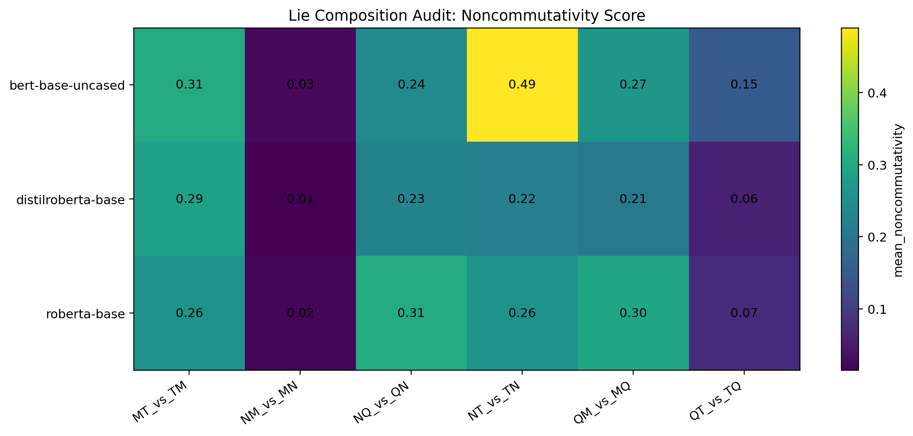

**Figure 1.** Noncommutativity heatmap for ordered operation pairs.

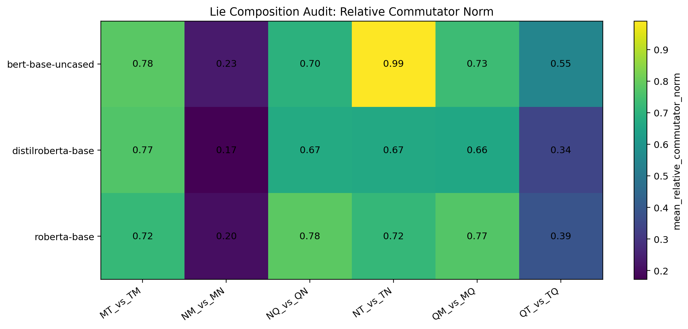

**Figure 2.** Relative commutator norm across operation pairs and models.

Observation:

Order matters, especially for transformations involving tense. This is necessary but not sufficient evidence for operator structure, because template wording alone could create order-sensitive embeddings.

Decoder composition has now been added, so decoder models are no longer present only in the favorable third-order diagnostic.

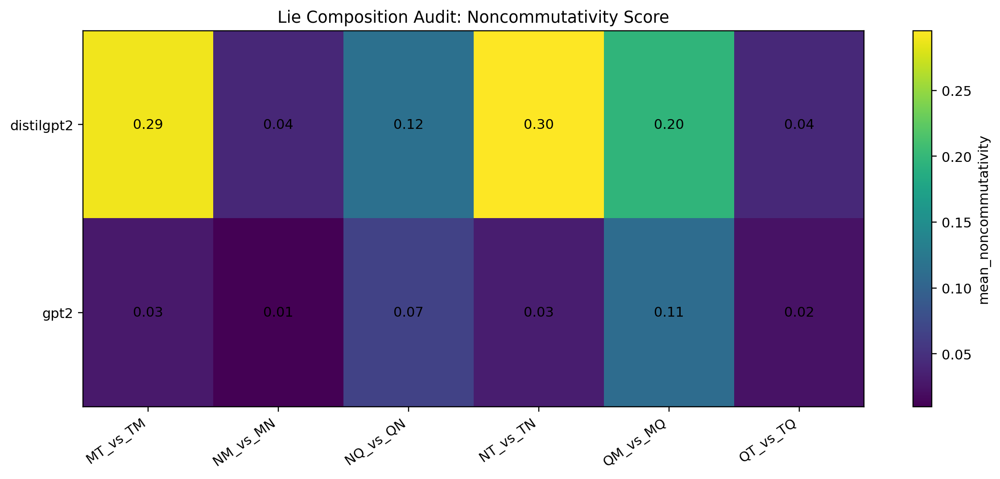

**Figure 3.** Decoder-model pairwise noncommutativity heatmap.

Key decoder rows:

| Model | Pair | Mean noncommutativity |
|---|---|---:|
| DistilGPT-2 | `NT_vs_TN` | `0.295` |
| DistilGPT-2 | `MT_vs_TM` | `0.289` |
| DistilGPT-2 | `QM_vs_MQ` | `0.196` |
| GPT-2 | `QM_vs_MQ` | `0.111` |
| GPT-2 | `NQ_vs_QN` | `0.066` |

Decoder pairwise composition is weaker for GPT-2 than for DistilGPT-2 under this mean-pooled PCA diagnostic, but it is not absent. This asymmetry should be reported rather than hidden.

## 5. Semantic Equivalence Control

The semantic equivalence control compares pairs intended to preserve meaning against pairs where order should change meaning.

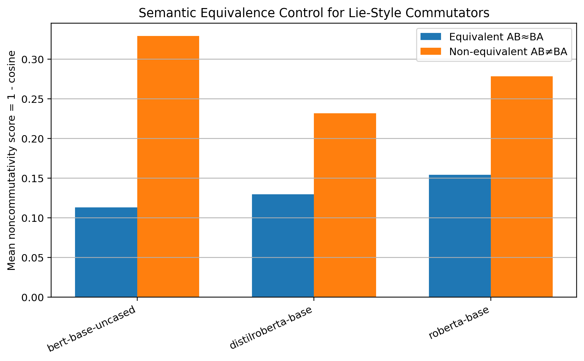

**Figure 4.** Equivalent pairs have lower mean noncommutativity, but distributions are broad.

Summary and tests:

| Model | Equivalent mean | Non-equivalent mean | Difference | Cohen d | Welch p | Mann-Whitney p |
|---|---:|---:|---:|---:|---:|---:|
| BERT | `0.113` | `0.329` | `0.216` | `2.53` | `2.21e-140` | `4.92e-131` |
| DistilRoBERTa | `0.129` | `0.232` | `0.102` | `2.35` | `2.17e-150` | `4.96e-117` |
| RoBERTa | `0.154` | `0.278` | `0.124` | `2.29` | `9.19e-142` | `5.07e-103` |

Interpretation:

The difference is statistically strong. But the control should not be oversold as a clean separation: the standard deviations are substantial and distributions overlap. The correct claim is that semantic-equivalence labels shift the distribution of noncommutativity, not that they perfectly separate pair types.

## 6. Tautological Antisymmetry Check

The implementation also checks whether:

```text
[A,B] ~= -[B,A]
```

This is not a scientific result. Given the endpoint definition:

```text
[A,B] = delta_AB - delta_BA
[B,A] = delta_BA - delta_AB
```

the identity `[A,B] = -[B,A]` follows algebraically for any vectors. We therefore do not treat perfect antisymmetry as evidence about transformers. The check is kept only as an implementation sanity test: if it failed, the code would be wrong.

## 7. Third-Order Signed Permutation Coherence

We avoid calling the main third-order test a Jacobi identity. The Lie-algebra Jacobi identity is:

```text
[A,[B,C]] + [B,[C,A]] + [C,[A,B]] = 0
```

Our endpoint-based diagnostic is different:

```text
S(A,B,C) = ABC + BCA + CAB - ACB - CBA - BAC
```

This is a signed alternating sum over six composition endpoints. It tests whether cyclic orderings and anti-cyclic orderings occupy a coherent signed geometry in embedding space. It is related in spirit to antisymmetric third-order structure, but it is not a formal Jacobi identity.

Metrics:

```text
relative_signed_permutation_norm = ||S|| / scale
signed_permutation_to_null_ratio = observed relative norm / permutation-null mean
```

The CSV still uses historical column names such as `relative_jacobi_norm` and `jacobi_to_null_mean_ratio`; these should be renamed in code before submission.

Controls:

- 1000 permutation-null samples per row
- 2000 bootstrap resamples for confidence intervals
- all four triples from `N,Q,M,T`: `NQM`, `NQT`, `NMT`, `QMT`
- endpoint audit: no duplicate endpoints in any row

Dataset audit:

| Triple | Rows | Unique sources | Unique endpoint texts | Duplicate endpoint rows |
|---|---:|---:|---:|---:|
| `NMT` | 100 | 100 | 600 | 0 |
| `NQM` | 100 | 100 | 600 | 0 |
| `NQT` | 100 | 100 | 600 | 0 |
| `QMT` | 100 | 100 | 600 | 0 |

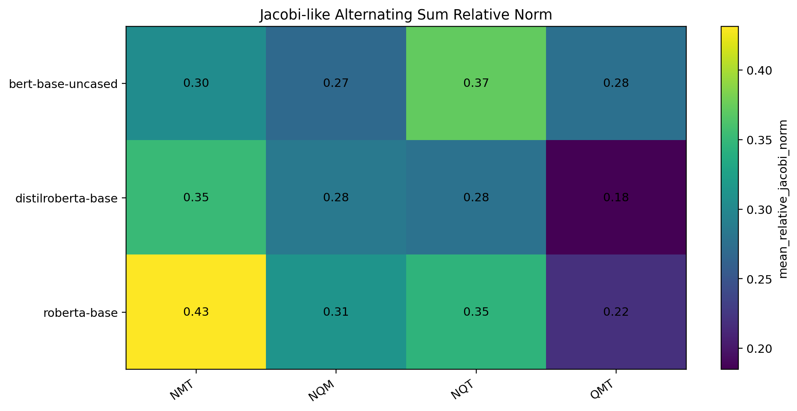

**Figure 5.** Relative norm of the third-order signed permutation sum.

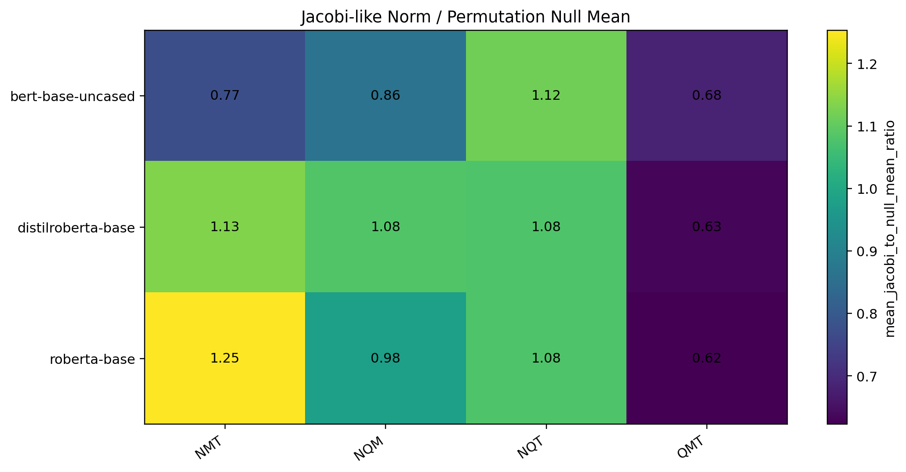

**Figure 6.** Ratio of observed signed permutation norm to permutation-null mean. Values below `1.0` indicate stronger-than-null cancellation.

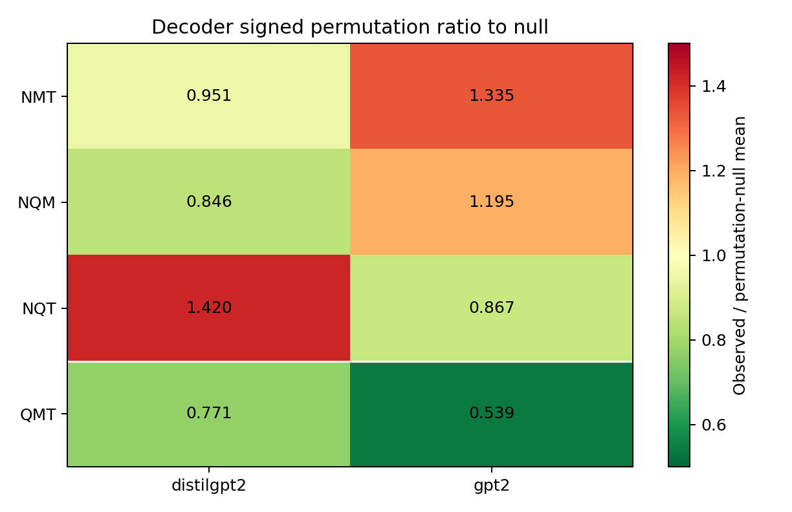

**Figure 7.** Decoder-model replication for the signed permutation ratio to permutation-null mean.

## 8. Main Third-Order Result

The most robust result in the original English encoder/decoder table is `QMT`.

| Model | Triple | Ratio to null | 95% CI |
|---|---|---:|---:|
| BERT | `QMT` | `0.683` | `[0.677, 0.689]` |
| DistilRoBERTa | `QMT` | `0.631` | `[0.627, 0.636]` |
| RoBERTa | `QMT` | `0.623` | `[0.617, 0.629]` |
| GPT-2 | `QMT` | `0.539` | `[0.519, 0.561]` |
| DistilGPT-2 | `QMT` | `0.771` | `[0.745, 0.797]` |

Negative or mixed cases:

| Model | Triple | Ratio to null | Interpretation |
|---|---|---:|---|
| BERT | `NQT` | `1.117` | worse than null |
| DistilRoBERTa | `NMT` | `1.134` | worse than null |
| RoBERTa | `NMT` | `1.253` | worse than null |
| RoBERTa | `NQM` | `0.980` | near null |
| GPT-2 | `NMT` | `1.335` | worse than null |
| GPT-2 | `NQM` | `1.195` | worse than null |
| DistilGPT-2 | `NQT` | `1.420` | worse than null |

Multiple-testing correction:

We applied a row-bootstrap test of whether the mean signed-permutation ratio is below `1.0`, followed by Bonferroni and Benjamini-Hochberg correction over all `4 triples x 5 models = 20` model/triple tests.

| Triple | Models passing Bonferroni below-null | Interpretation |
|---|---:|---|
| `QMT` | `5/5` | only fully cross-architecture stable below-null triple |
| `NQM` | `3/5` | below-null in BERT, RoBERTa, DistilGPT-2; fails in DistilRoBERTa and GPT-2 |
| `NMT` | `2/5` | below-null in BERT and DistilGPT-2; worse than null in several models |
| `NQT` | `1/5` | below-null only in GPT-2; worse than null elsewhere |

Therefore, the central claim is now narrower:

> `QMT` is the only tested triple with stable third-order signed permutation cancellation stronger than null across all five tested models after table-level multiple-testing correction.

This statement is now explicitly scoped to the original English encoder/decoder table. It should not be repeated as the global project claim.

## 8.1 Multilingual Max Audit

The 2026-06-23 scale-up tests whether the signed-permutation diagnostic survives beyond English templates and the original encoder/decoder set.

Setup:

- 7 languages: English, Spanish, French, German, Russian, Chinese, Arabic
- 5 multilingual encoders: paraphrase-multilingual-mpnet-base-v2, LaBSE, multilingual-e5-large, BGE-M3, and mBERT
- 48 templates per language
- 2000 signed-null samples per row
- PCA dimension 96
- held-out-language endpoint/source/delta/commutator controls

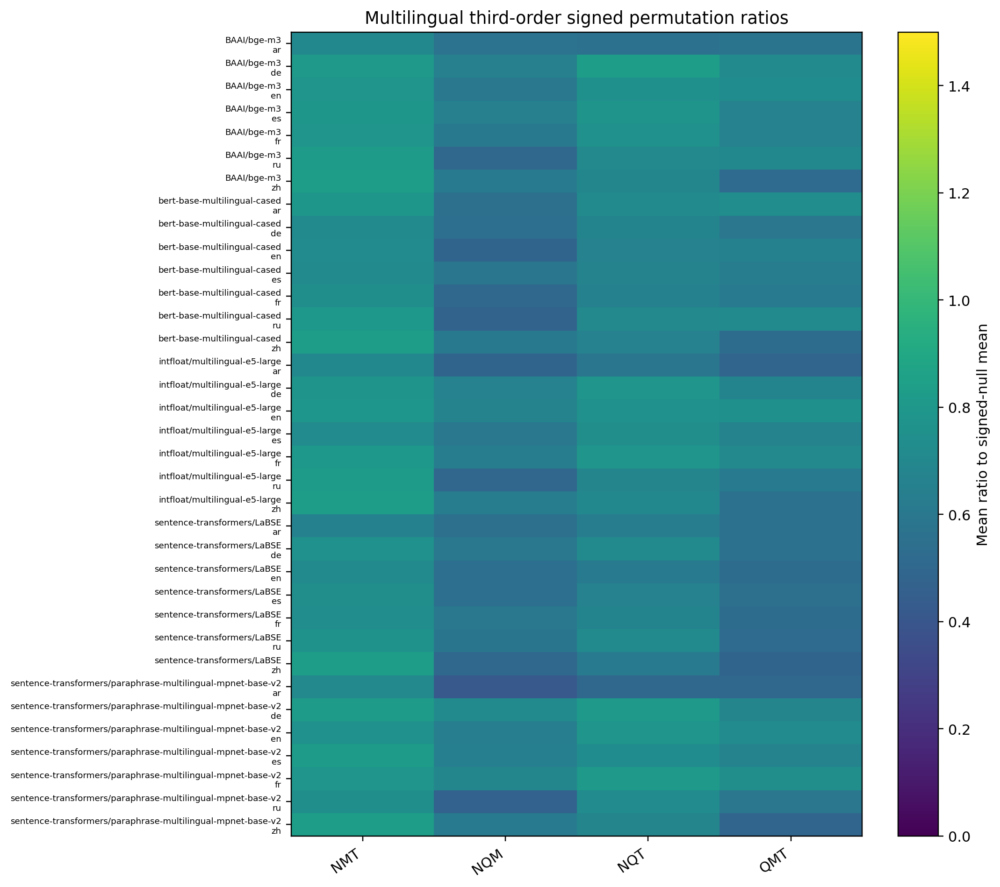

**Figure 8.** Multilingual signed-permutation ratio to signed-null mean. Values below `1.0` indicate stronger-than-null cancellation.

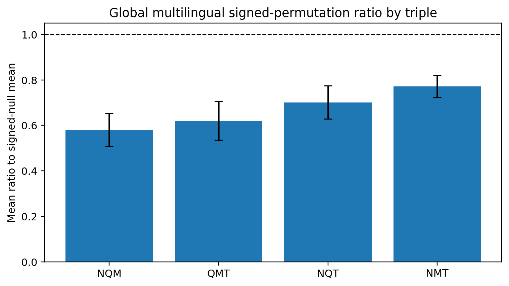

**Figure 9.** Global mean ratio to signed-null by triple across all model-language cells.

Global result:

| Triple | Mean ratio to signed-null | Std | Cells below null |
|---|---:|---:|---:|
| `NQM` | `0.580` | `0.072` | `35/35` |
| `QMT` | `0.620` | `0.085` | `35/35` |
| `NQT` | `0.701` | `0.073` | `35/35` |
| `NMT` | `0.772` | `0.049` | `35/35` |

This is the strongest current evidence that the signed-permutation diagnostic is not only an English-template artifact. But it also weakens the older `QMT`-only narrative. In the multilingual setting, `NQM` is the strongest global triple and all four triples pass below null in every model-language cell.

Controls:

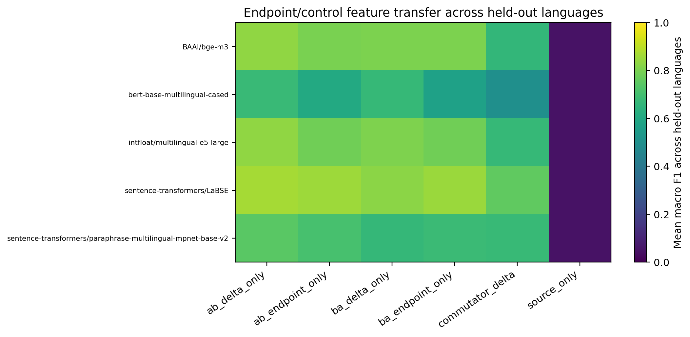

**Figure 10.** Held-out-language controls. Source-only features are chance-like, while endpoint/delta/commutator features remain high.

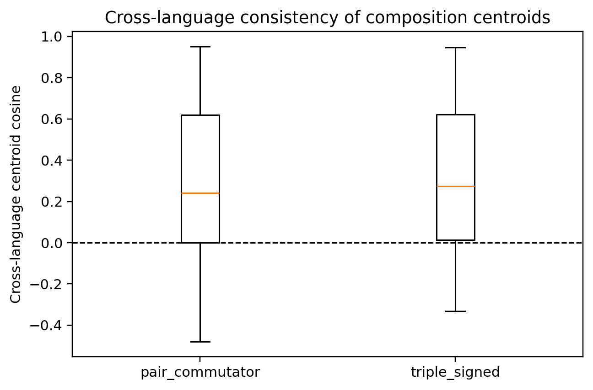

**Figure 11.** Cross-language centroid consistency is moderate and high-variance, not a clean universality result.

Interpretation:

The multilingual audit moves Track 2 closer to the algebraic-composition goal because the third-order signal survives a much broader model/language grid. It is still not endpoint-independent algebraic evidence. Endpoint and delta controls remain strong, and cross-language centroid alignment is only moderate (`mean cosine ~= 0.32`). The next necessary experiment is endpoint-balanced multilingual generation plus target-only controls over the six third-order endpoints.

## 8.2 Endpoint-Subspace Residualization Audit

The 2026-06-24 audit asks whether the multilingual signed-permutation signal is merely a linear endpoint artifact. Instead of only reporting endpoint-control classifiers, we train held-out-language endpoint probes and remove their learned coefficient rowspaces before recomputing the signed-permutation diagnostic.

Scripts and outputs:

- sign-direction residualization: [run_lie_endpoint_residualization_audit.py](../../../scripts/run_lie_endpoint_residualization_audit.py)
- endpoint-subspace residualization: [run_lie_endpoint_subspace_residualization_audit.py](../../../scripts/run_lie_endpoint_subspace_residualization_audit.py)
- sign-residualized results: [lie_endpoint_residualization_results](../../../results/experiments/lie_endpoint_residualization_results/)
- subspace-residualized results: [lie_endpoint_subspace_residualization_results](../../../results/experiments/lie_endpoint_subspace_residualization_results/)

Setup:

- 7 languages: English, Spanish, French, German, Russian, Chinese, Arabic
- 7 multilingual models: paraphrase-multilingual-mpnet-base-v2, LaBSE, multilingual-e5-large, BGE-M3, mBERT, XLM-RoBERTa-base, and DistilBERT multilingual cased
- 96 templates per language
- PCA dimension 96
- exact signed-null over the admissible six-endpoint sign assignments
- held-out-language endpoint probes

The endpoint probes confirm that endpoint deltas contain task-readable information:

| Endpoint probe | Mean macro F1 | Chance |
|---|---:|---:|
| cyclic versus anticyclic from endpoint delta | `0.522386` | `0.500000` |
| endpoint position from endpoint delta | `0.273599` | `0.166667` |
| triple label from single endpoint delta | `0.755258` | `0.250000` |

We then remove the learned endpoint-derived subspaces and recompute the ratio of the observed signed-permutation norm to the exact signed-null mean.

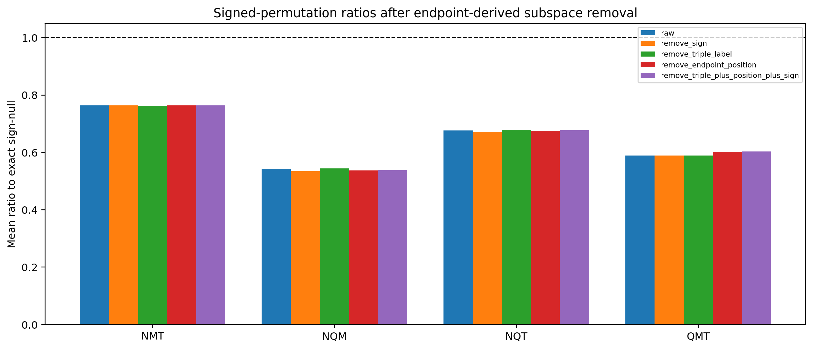

**Figure 12.** Signed-permutation ratios after removing endpoint-derived probe subspaces. Values below `1.0` indicate stronger-than-null cancellation.

Global result:

| Triple | Raw | Remove sign | Remove triple label | Remove endpoint position | Remove all |
|---|---:|---:|---:|---:|---:|
| `NMT` | `0.764073` | `0.763916` | `0.763325` | `0.764539` | `0.764100` |
| `NQM` | `0.543409` | `0.534386` | `0.544664` | `0.537042` | `0.538300` |
| `NQT` | `0.676606` | `0.671906` | `0.679131` | `0.675365` | `0.677458` |
| `QMT` | `0.589554` | `0.589631` | `0.589615` | `0.602188` | `0.603670` |

This is a stronger endpoint-artifact control than the previous classifier-only check. The signed-permutation signal largely survives removal of endpoint sign, triple-label, and endpoint-position subspaces, and every global ratio remains far below `1.0`.

The result should still be stated conservatively. The audit removes linear rowspaces learned by specific endpoint probes; it does not prove that all endpoint information is absent, nor does it establish a formal Jacobi identity. The correct claim is narrower:

> In the current multilingual synthetic template regime, third-order signed-permutation coherence is not explained by simple linear endpoint-sign, endpoint-position, or triple-label probe subspaces.

## 8.3 Structure-Constants Closure Audit

The 2026-06-24 structure-constants audit is a bridge from GLT-SPOT toward GLT-MOLT. Instead of only testing endpoint signed-permutation sums, it estimates primitive operator centroids for `N,Q,M,T`, computes pairwise commutator centroids `[A,B] = AB - BA`, and asks whether those commutators are compressible into the span of the primitive operators.

Setup:

- 7 languages: English, Spanish, French, German, Russian, Chinese, Arabic
- 7 multilingual models: paraphrase-multilingual-mpnet-base-v2, LaBSE, multilingual-e5-large, BGE-M3, mBERT, XLM-RoBERTa-base, and DistilBERT multilingual cased
- 160 templates per language
- 31,776 unique texts
- PCA dimension 128
- 1000 random-subspace null samples per model/language/pair

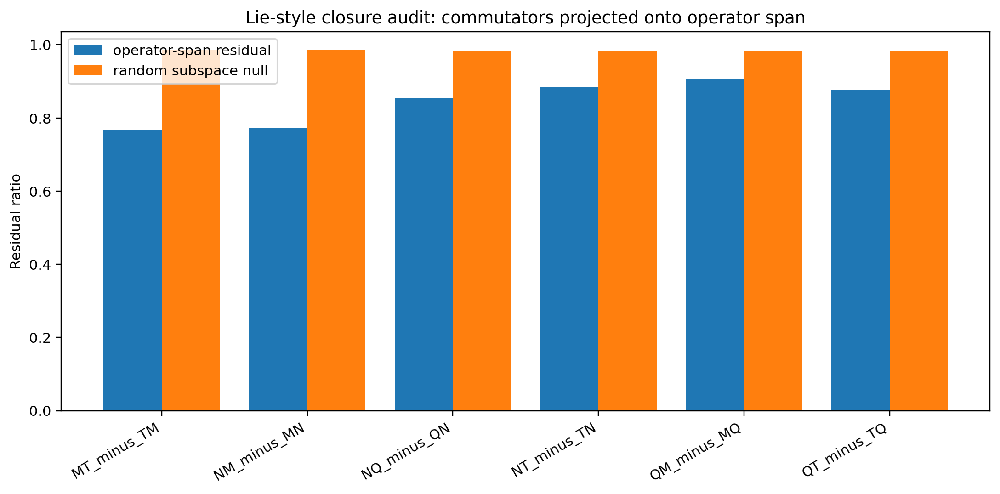

**Figure 13.** Commutator residual after projection into the primitive operator span, compared with random subspace residuals. Lower values mean stronger closure-like compression.

Global closure result:

| Pair | Mean closure residual | Random-subspace null |
|---|---:|---:|
| `MT - TM` | `0.767` | `0.986` |
| `NM - MN` | `0.772` | `0.987` |
| `NQ - QN` | `0.853` | `0.984` |
| `NT - TN` | `0.885` | `0.984` |
| `QT - TQ` | `0.878` | `0.984` |
| `QM - MQ` | `0.905` | `0.984` |

A caveat is important: in Chinese, `NM - MN` and `MT - TM` have zero commutator norm for every model under the current templates. These cells should be treated as template degeneracies rather than evidence of perfect closure. Removing zero-commutator cells still leaves the nonzero mean closure residual below the random-subspace null (`0.885` versus `0.984` overall), but the effect is partial rather than exact.

The same audit estimates a Jacobi-like residual from the learned structure constants:

| Triple | Mean relative Jacobi closure norm |
|---|---:|
| `NMT` | `0.309` |
| `QMT` | `0.333` |
| `NQM` | `0.431` |
| `NQT` | `0.853` |

This is the first result in the repository that resembles structure constants rather than only endpoint signed sums. It supports a narrow claim:

> Pairwise linguistic commutators are partially compressible into the span of primitive operator centroids better than random subspaces, and the resulting estimated structure constants produce lower Jacobi-like residuals for `NMT` and `QMT` than for `NQT`.

It still does not prove a Lie algebra. The primitive objects are centroids of endpoint displacements, not learned local linear maps; closure is partial; and the Chinese zero-commutator cells reveal template degeneracy. This motivates the GLT-MOLT learned-operator audit below, where commutators are computed directly over ridge-regularized linear and affine maps.

## 8.4 GLT-MOLT Learned Operator Maps

The structure-constants audit asks whether endpoint-derived commutator centroids can be compressed into the span of primitive displacement centroids. The next GLT-MOLT test is more directly operator-valued: for each primitive transformation `N,Q,M,T`, learn a map from source embeddings to target embeddings and compute commutators over the learned maps.

We compare three prediction families:

- additive centroid deltas: `y ~= x + delta_op`
- linear ridge maps: `y ~= W_op x`
- affine ridge maps: `y ~= W_op x + b_op`

The 2026-06-29/30 9-model audit uses the same 7-language multilingual setting as the endpoint-subspace stress tests, with `160` templates per language, PCA dimension `128`, and `1000` random-subspace nulls in the confirmation run.

Main result:

| Method | Mean target cosine | Mean closure residual | Random-subspace null | Mean relative Jacobi-like norm |
|---|---:|---:|---:|---:|
| additive | `0.903` | n/a | n/a | n/a |
| linear | `0.738` | `0.975` | `~0.9999` | `0.067` |
| affine | `0.695` | `0.971` | `~0.9999` | `0.064` |

The split is important. Additive deltas remain much better one-step target predictors, but learned matrix operators produce a weak closure-like signal: their commutators are still far from exactly closed, yet their residuals after projection into the primitive operator span are systematically below random-subspace nulls.

This should not be overread as a Lie algebra. It is evidence for weak closure-like compression in ridge-regularized PCA-space maps. Ridge smoothing may itself make maps algebraically cleaner, so the result requires regularization controls.

The 2026-07-01 ridge sweep tests that concern by rerunning the GLT-MOLT audit over ridge alphas `0.1`, `1.0`, `10.0`, and `100.0`.

Mean target cosine:

| Ridge alpha | additive | linear | affine |
|---:|---:|---:|---:|
| `0.1` | `0.903` | `0.681` | `0.659` |
| `1.0` | `0.903` | `0.712` | `0.685` |
| `10.0` | `0.903` | `0.738` | `0.695` |
| `100.0` | `0.903` | `0.712` | `0.640` |

Mean matrix-closure residual:

| Ridge alpha | linear | affine | random-subspace null |
|---:|---:|---:|---:|
| `0.1` | `0.995` | `0.994` | `~0.9999` |
| `1.0` | `0.991` | `0.991` | `~0.9999` |
| `10.0` | `0.975` | `0.970` | `~0.9999` |
| `100.0` | `0.882` | `0.855` | `~0.9999` |

Mean relative Jacobi-like operator norm:

| Ridge alpha | linear | affine |
|---:|---:|---:|
| `0.1` | `0.093` | `0.097` |
| `1.0` | `0.080` | `0.083` |
| `10.0` | `0.067` | `0.064` |
| `100.0` | `0.072` | `0.042` |

The ridge sweep confirms that the closure-like signal is not isolated to one alpha, but it also sharpens the limitation: algebraic cleanliness improves under heavier regularization while target prediction does not. The next GLT-MOLT control must therefore compare against matched operator nulls, not only random subspaces.

The 2026-07-02 matched-null audit adds that control for `alpha=10` and `alpha=100`. It compares observed learned-operator closure against three null families:

- random subspaces
- Gaussian operator maps matched to the Frobenius norms of the learned primitive operators
- signed-permutation matched operator maps, which preserve each learned operator's entries up to row/column permutations and sign flips

Mean matrix-closure residual:

| Ridge alpha | Method | Observed | Random-subspace null | Gaussian norm-matched null | Signed-permutation matched null |
|---:|---|---:|---:|---:|---:|
| `10` | affine | `0.970` | `0.99988` | `0.99988` | `0.99978` |
| `10` | linear | `0.975` | `0.99988` | `0.99988` | `0.99977` |
| `100` | affine | `0.855` | `0.99988` | `0.99988` | `0.99989` |
| `100` | linear | `0.882` | `0.99988` | `0.99988` | `0.99989` |

For `alpha=100`, all mean empirical p-values are at the `N=1000` resolution floor (`0.000999`) across all three null families. For `alpha=10`, the observed closure is still below every matched-null family, with mean p-values around `0.002-0.009` depending on method and null.

This is the strongest current GLT-MOLT evidence. It weakens the concern that the closure result is only a generic random-subspace or norm-scale artifact. However, it does not erase the central caveat: `alpha=100` gives cleaner algebraic compression but worse target prediction than `alpha=10`. The result should therefore be framed as:

> Learned linguistic operator maps contain weak but robust closure-like compression under matched null controls, while endpoint reconstruction and algebraic compression remain different objectives.

Relevant artifacts:

- script: [run_glt_molt_affine_operator_audit.py](../../../scripts/run_glt_molt_affine_operator_audit.py)
- ridge sweep script: [run_glt_molt_ridge_sweep.py](../../../scripts/run_glt_molt_ridge_sweep.py)
- matched-null script: [run_glt_molt_matched_nulls.py](../../../scripts/run_glt_molt_matched_nulls.py)
- 1000-null results: [glt_molt_affine_operator_9m_160t_1000null_results](../../../results/experiments/glt_molt_affine_operator_9m_160t_1000null_results/)
- ridge sweep results: [glt_molt_ridge_sweep_9m_160t_300null_results](../../../results/experiments/glt_molt_ridge_sweep_9m_160t_300null_results/)
- matched-null results: [glt_molt_matched_nulls_9m_160t_a10_100_1000null_results](../../../results/experiments/glt_molt_matched_nulls_9m_160t_a10_100_1000null_results/)

Working hypothesis for why `QMT` is coherent:

`Q`, `M`, and `T` are all clause-level operators that modify illocution, epistemic status, or temporal anchoring while preserving the same event frame. Their endpoints can remain relatively aligned around one proposition. Negation (`N`) changes truth-conditional polarity and often introduces lexical/scope markers that interact with syntax more sharply. This makes `N` easy to detect as a one-step surface-labeled transformation, but less stable as a component in ordered composition.

This is still a hypothesis, not a proven linguistic theory. After the multilingual max audit it also becomes incomplete: the project must explain why `NQM` becomes strongest under multilingual templates and multilingual encoders.

Critical template caveat:

The original Lie-style dataset is synthetic and hand-written. Several operations have stable lexical markers: negation often introduces "failed to", questions often begin with a fixed auxiliary pattern, and tense can introduce explicit temporal markers. Variant transfer partially reduces this concern in Track 1, but the Lie-style composition experiments still need endpoint-balanced grammar generation before submission. Until then, the Track 2 claim is a diagnostic result about controlled probe sets, not a general claim about natural-language operator algebra.

Update after the first grammar-generated pairwise control:

- A grammar-generated `N,Q,M,T` pairwise composition probe now exists.
- Observed relative commutator norms remain below `N=1000` shuffled and norm-matched nulls.
- Endpoint-only and delta-only controls classify pair labels almost perfectly.

This improves the evidence that pairwise order structure is not destroyed by grammar variation, but it does not solve the endpoint-artifact problem. The next version needs endpoint-balanced grammar generation and target-only controls for third-order composition endpoints.

## 9. Negation Is a Result, Not Just a Limitation

Negation-containing triples are where the structure breaks most clearly. This should be interpreted as a substantive finding.

Working hypothesis:

Negation may not behave like a smooth linear direction in these embedding spaces. It can interact with scope, syntax, and surface markers in ways that make endpoint geometry less coherent. This aligns with the broader concern that transformer representations often handle negation less robustly than positive factual content.

Immediate follow-up:

- isolate negation-only transformations in Track 1 confusion analysis
- compare `N` pairwise commutators against non-`N` pairwise commutators
- generate paraphrases where negation markers are less lexically obvious
- test whether middle layers represent negation more coherently than final layers

Decoder replication sharpens this point. GPT-2 shows strong `QMT` cancellation (`0.539`) but fails on `NMT` and `NQM`; DistilGPT-2 keeps `NMT` and `NQM` below null but fails badly on `NQT`. The important fact is not merely that negation is hard, but that negation changes the algebraic diagnostic differently across architectures.

## 10. What This Evidence Does and Does Not Prove

Evidence layers:

1. Pairwise composition gives noncommutativity.
2. Semantic controls show a statistically significant distribution shift.
3. Signed permutation coherence identifies robust controlled third-order effects.
4. Multiple-testing correction shows that QMT is the only below-null triple passing across all five models in the original English encoder/decoder table.
5. The multilingual max audit broadens the effect to all four tested triples across 7 languages and 5 multilingual encoders.
6. Endpoint-subspace residualization shows that the multilingual signed-permutation effect largely survives removal of simple endpoint-derived probe subspaces.
7. The structure-constants audit finds partial closure-like compression of pairwise commutators into the primitive operator span better than random subspaces.
8. Learned GLT-MOLT matrix operators show weak closure-like compression, but the signal is regularization-sensitive.
9. Negation triples are regime-dependent, which constrains the theory.
10. Grammar-generated pairwise controls preserve below-null commutator coherence, but endpoint controls remain too strong.

Not proven:

- global Lie algebra
- formal Jacobi identity
- model-independent operator calculus
- endpoint-balanced robustness to grammar-generated templates
- broad decoder-model generality beyond the two spot-checks
- lexical-marker independence of the hand-written composition templates
- endpoint-balanced multilingual robustness
- removal of all possible nonlinear endpoint artifacts
- matrix/operator-valued closure under singular-spectrum or layerwise matched operator nulls
- non-degenerate endpoint-balanced closure across all languages and pairs

## 11. Required Pre-Submission Experiments

1. Rename code/CSV columns away from `jacobi_*` toward `signed_permutation_*`.
2. Build endpoint-balanced grammar templates.
3. Add target-only controls for third-order composition endpoints.
4. Add endpoint-balanced multilingual generation and rerun the 7-language audit.
5. Add nonlinear endpoint-artifact controls or adversarial endpoint balancing.
6. Extend GLT-MOLT matched-null controls:
   - compare learned matrix closure against singular-spectrum/shrinkage-matched operator nulls
   - test layerwise and PCA-dimension sensitivity
   - report whether the closure signal survives beyond last-layer PCA-space maps
7. Explain the `NQM` versus `QMT` reversal across regimes.
8. Add layerwise analysis.
9. Add pooling ablation.
10. Add a focused negation analysis before adding new operators.
11. Add prior-work positioning and bibliography.

## Current Status

This is a promising diagnostic study, but it is not submission-ready. The current result is useful precisely because it is falsifiable: signed-permutation cancellation survives a large multilingual scale-up and simple endpoint-subspace removal, while endpoint controls and regime-dependent triple rankings expose the boundary of the phenomenon.
