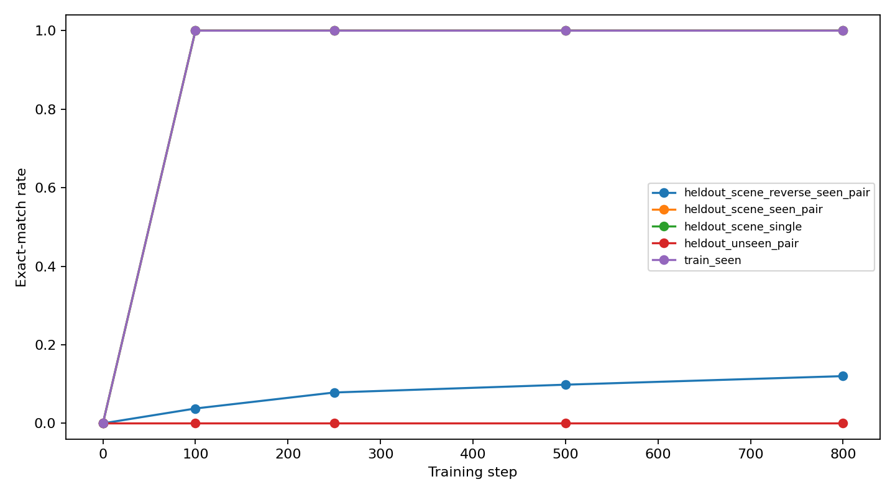
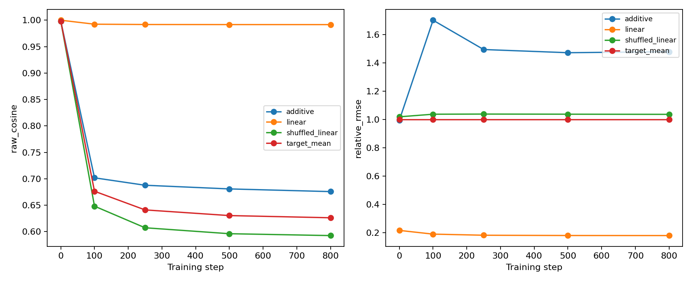

# GLT-BUILD-01A: Corrected Composition Audit

Completed exploratory follow-up; three training seeds are not a definitive population estimate.

## Interpretation Recorded After Validation

The run completed all three seeds and five observations in 126 seconds. All 30
weight/readout hashes and the execution-source hashes were verified. Output counts
are 23,520 behavior rows, 9,240 composition rows, 33,000 intervention rows, and 4,050
aggregate representation-fit rows. No further experiment is part of this audit.

Exhaustive evaluation confirms 100% known single/pair command execution, 127/1056
correct reversed seen-pair commands (12.03%), and 0/792 unseen-pair commands. The
new text-mediated execution contrast is specific to SQ, not general composition:

| Pair (A first, then B) | Direct AB | Sequential AB | Sequential BA | Oracle intermediate AB |
|---|---:|---:|---:|---:|
| TN | 1.0000 | 0.0000 | 0.0000 | 0.0000 |
| TQ | 1.0000 | 0.0000 | 0.0000 | 0.0000 |
| NQ | 1.0000 | 0.0000 | 0.0000 | 0.0000 |
| VQ | 1.0000 | 0.0000 | 0.0000 | 0.0000 |
| NV | 0.0000 | 0.0000 | 0.0000 | 0.0000 |
| TV | 0.0000 | 0.0000 | 0.0000 | 0.0000 |
| SQ | 0.0000 | 1.0000 | 0.0000 | 1.0000 |

Each row/mode has 88 source scenes reused across three seeds (264 generations).
The 33.33% aggregate sequential score for unseen pairs below is entirely SQ.
Every first single-operation step is correct. Swapping roles preserves the input
form used during training; the other first operations change it. Failure persists
with oracle intermediates, supporting an input-support explanation rather than
first-step error propagation. A controlled change to training support would be
needed to establish that explanation causally. This is not a noncommutative
algebra finding: the generator's operations commute, and the model makes errors.

At the final layer, linear prediction beats the mean-target baseline on centered
metrics: relative RMSE is 0.1796 versus 1.0, while the shuffled map gives 1.0355.
However, strong linear predictability already exists before training (relative
RMSE 0.2162; centered cosine 0.9811). Layer-zero content averaging alone yields
linear raw cosine 0.999996 at initialization. This exposes substantial structure
from token representation and controlled surface forms without learned task
execution. In particular, layer-zero content means cannot distinguish role swaps
with the same token multiset. High fit does not establish a learned causal
operator. Final-layer mean-vector interventions remain 0/1320.

`nan` in displayed centered metrics denotes an undefined quantity; the CSV field
is blank. A constant prediction has no centered direction. Degenerate bootstrap
intervals at rates 0 and 1 reflect the empirical sample, not certainty about new
sources, seeds, grammars or model sizes.

## Protocol

The training grammar, scene split, operation examples and architecture match the 2026-09-11 pilot. Default evaluation uses every held-out scene. Training sanity checks cover all eight subjects. All five operations commute in the external generator. No endpoint-equality measurement is counted as learned commutativity.

AB means apply A first, then B. Sequential AB feeds the generated A output into command B; oracle AB feeds the correct A intermediate into B. Transformed sources were not training inputs, so sequential/oracle failure also tests this input-distribution boundary. Order agreement alone can reflect two wrong outputs.

## Behavioral Exact Match

| family | rate | n_rows | n_sources | n_seeds | seed_std | ci_low | ci_high |
| --- | --- | --- | --- | --- | --- | --- | --- |
| heldout_scene_reverse_seen_pair | 0.1203 | 1056 | 88 | 3 | 0.0986 | 0.0341 | 0.2159 |
| heldout_scene_seen_pair | 1.0000 | 1056 | 88 | 3 | 0.0000 | 1.0000 | 1.0000 |
| heldout_scene_single | 1.0000 | 1320 | 88 | 3 | 0.0000 | 1.0000 | 1.0000 |
| heldout_unseen_pair | 0.0000 | 792 | 88 | 3 | 0.0000 | 0.0000 | 0.0000 |
| train_seen | 1.0000 | 480 | 16 | 3 | 0.0000 | 1.0000 | 1.0000 |

## Actual Model Composition

| pair_seen_in_training | metric | rate | n_rows | n_sources | n_seeds | seed_std | ci_low | ci_high |
| --- | --- | --- | --- | --- | --- | --- | --- | --- |
| 0 | direct_ab_correct | 0.0000 | 792 | 88 | 3 | 0.0000 | 0.0000 | 0.0000 |
| 0 | direct_ba_correct | 0.0000 | 792 | 88 | 3 | 0.0000 | 0.0000 | 0.0000 |
| 0 | direct_both_correct | 0.0000 | 792 | 88 | 3 | 0.0000 | 0.0000 | 0.0000 |
| 0 | direct_order_agreement | 0.1515 | 792 | 88 | 3 | 0.1321 | 0.0000 | 0.2500 |
| 0 | oracle_ab_correct | 0.3333 | 792 | 88 | 3 | 0.0000 | 0.3333 | 0.3333 |
| 0 | oracle_ba_correct | 0.0000 | 792 | 88 | 3 | 0.0000 | 0.0000 | 0.0000 |
| 0 | sequential_ab_correct | 0.3333 | 792 | 88 | 3 | 0.0000 | 0.3333 | 0.3333 |
| 0 | sequential_ba_correct | 0.0000 | 792 | 88 | 3 | 0.0000 | 0.0000 | 0.0000 |
| 0 | sequential_both_correct | 0.0000 | 792 | 88 | 3 | 0.0000 | 0.0000 | 0.0000 |
| 0 | sequential_order_agreement | 0.0404 | 792 | 88 | 3 | 0.0700 | 0.0000 | 0.1136 |
| 1 | direct_ab_correct | 1.0000 | 1056 | 88 | 3 | 0.0000 | 1.0000 | 1.0000 |
| 1 | direct_ba_correct | 0.1203 | 1056 | 88 | 3 | 0.0986 | 0.0312 | 0.2188 |
| 1 | direct_both_correct | 0.1203 | 1056 | 88 | 3 | 0.0986 | 0.0312 | 0.2188 |
| 1 | direct_order_agreement | 0.1203 | 1056 | 88 | 3 | 0.0986 | 0.0284 | 0.2217 |
| 1 | oracle_ab_correct | 0.0000 | 1056 | 88 | 3 | 0.0000 | 0.0000 | 0.0000 |
| 1 | oracle_ba_correct | 0.0000 | 1056 | 88 | 3 | 0.0000 | 0.0000 | 0.0000 |
| 1 | sequential_ab_correct | 0.0000 | 1056 | 88 | 3 | 0.0000 | 0.0000 | 0.0000 |
| 1 | sequential_ba_correct | 0.0000 | 1056 | 88 | 3 | 0.0000 | 0.0000 | 0.0000 |
| 1 | sequential_both_correct | 0.0000 | 1056 | 88 | 3 | 0.0000 | 0.0000 | 0.0000 |
| 1 | sequential_order_agreement | 0.0000 | 1056 | 88 | 3 | 0.0000 | 0.0000 | 0.0000 |

## Mean-Delta Interventions

| operation | condition | rate | n_rows | n_sources | n_seeds | seed_std | ci_low | ci_high |
| --- | --- | --- | --- | --- | --- | --- | --- | --- |
| N | target_vector | 0.0000 | 264 | 88 | 3 | 0.0000 | 0.0000 | 0.0000 |
| Q | target_vector | 0.0000 | 264 | 88 | 3 | 0.0000 | 0.0000 | 0.0000 |
| S | target_vector | 0.0000 | 264 | 88 | 3 | 0.0000 | 0.0000 | 0.0000 |
| T | target_vector | 0.0000 | 264 | 88 | 3 | 0.0000 | 0.0000 | 0.0000 |
| V | target_vector | 0.0000 | 264 | 88 | 3 | 0.0000 | 0.0000 | 0.0000 |

Interventions repeat at the last position of every full-prefix forward pass, at the final layer, gain 1. Only this intervention recipe is tested. All control rows are in csv/causal_summary.csv.

## Initialization And Geometry Controls

| checkpoint_step | readout | method | raw_cosine | centered_cosine | relative_rmse |
| --- | --- | --- | --- | --- | --- |
| 0 | last_sep_layer_2 | additive | 0.9983 | 0.6028 | 0.9942 |
| 0 | last_sep_layer_2 | linear | 0.9999 | 0.9811 | 0.2162 |
| 0 | last_sep_layer_2 | shuffled_linear | 0.9981 | 0.0082 | 1.0181 |
| 0 | last_sep_layer_2 | target_mean | 0.9981 | nan | 1.0000 |
| 800 | last_sep_layer_2 | additive | 0.6757 | 0.5660 | 1.4779 |
| 800 | last_sep_layer_2 | linear | 0.9916 | 0.9793 | 0.1796 |
| 800 | last_sep_layer_2 | shuffled_linear | 0.5925 | -0.0104 | 1.0355 |
| 800 | last_sep_layer_2 | target_mean | 0.6262 | nan | 1.0000 |

Raw cosine must be compared to checkpoint zero and the per-operation mean-target baseline. Centered cosine subtracts the training target mean. Relative RMSE is normalized by the mean-target prediction error; 1 equals that baseline and lower is better. Undefined centered metrics for constant embedding readouts are left blank. Layer 0 is token-plus-position embedding only; content_mean excludes prefix tokens and separators. The shuffled linear/affine maps use one fixed training-target permutation per seed/operation, a diagnostic control, not a p-value. Both pooling choices are fixed in advance; no layer, gain or regularizer selection uses evaluation scores.

## Uncertainty And Artifacts

Rates average scenes equally and retain repeated seeds within scene. Intervals are 95% percentile intervals from 1000 crossed scene/seed bootstrap draws. With only three seeds or all-zero/all-one observations they can be narrow or degenerate; they do not assert population certainty. The scene holdout uses known words and one grammar; it is not a lexical or template holdout.

Weights, optimizer and RNG states are in local checkpoints/. Sentence readouts (both modes, every layer including layer 0) are in local hidden/ and indexed by csv/representation_sentences.csv. These are selected readouts, not full token activation tensors. artifacts.json records sizes and SHA-256 hashes. The script reconstructs them from metadata.json; binary artifacts are excluded from Git to keep the repository compact.

