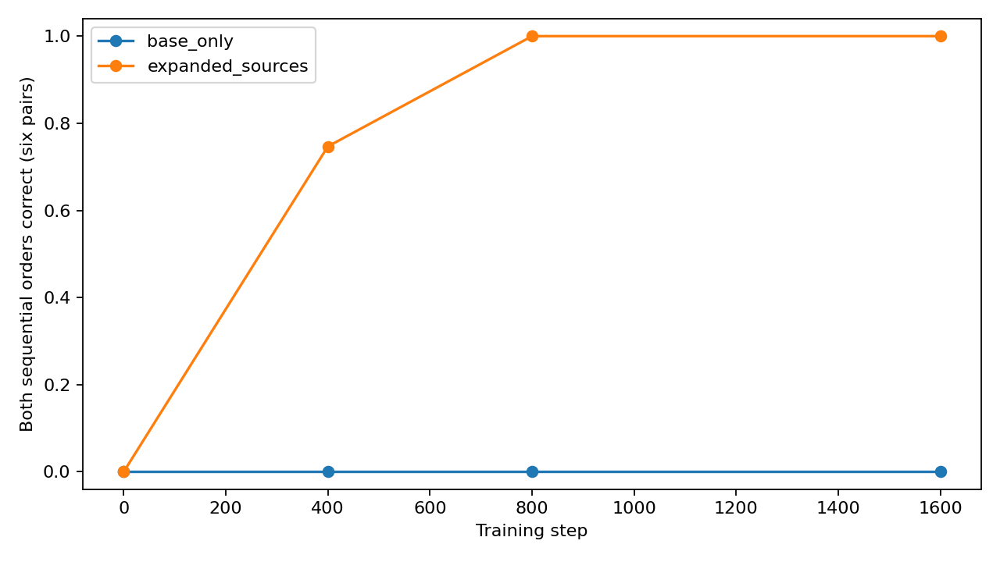

# GLT-BUILD-01A: Paired Input-Support Experiment

Status: completed exploratory experiment. Read decision.json together with the competency and per-pair tables.

## Design

Two arms share the initial weights, scene/command draw schedule, optimizer, updates, batch size and fixed padded training shape. In expanded_sources only identity/single-operation examples vary the four binary source-state features. Taught pair commands retain base inputs in both arms. Prediction-token counts differ with sentence length and are recorded; this is not an equal-target-token intervention.

The split groups both participant orders with the same verb together: 180 training and 44 held-out semantic groups (360 and 88 directed scenes). No source state or operation endpoint can cross this group split. The split and vocabulary order differ from the earlier pilot, so the paired base_only arm is the comparator.

## Primary Result

| checkpoint_step | metric | base_only | expanded_sources | difference | n_group_seed_pairs | n_scene_groups | n_seeds | seed_std | ci_low | ci_high |
| --- | --- | --- | --- | --- | --- | --- | --- | --- | --- | --- |
| 0 | sequential_both_correct | 0.0000 | 0.0000 | 0.0000 | 132 | 44 | 3 | 0.0000 | 0.0000 | 0.0000 |
| 400 | sequential_both_correct | 0.0000 | 0.7468 | 0.7468 | 132 | 44 | 3 | 0.3056 | 0.4336 | 0.9886 |
| 800 | sequential_both_correct | 0.0000 | 1.0000 | 1.0000 | 132 | 44 | 3 | 0.0000 | 1.0000 | 1.0000 |
| 1600 | sequential_both_correct | 0.0000 | 1.0000 | 1.0000 | 132 | 44 | 3 | 0.0000 | 1.0000 | 1.0000 |

Primary metric: both sequential orders correct, macro-averaged over TN/TQ/NQ/VQ/NV/TV; SQ is a separate positive-control pair. The predeclared rescue rule requires a gain of at least 0.20, a positive lower paired-bootstrap bound, and at least 95% base single-step competence in both arms plus 95% nonbase single-step competence in expanded_sources. The final fixed checkpoint is primary; earlier scores do not select a stopping point. Rule outcome: **input_support_rescue_under_fixed_protocol**.

## Primitive And Direct-Command Checks

| arm | family | rate | n_rows | n_scene_groups | n_seeds | seed_std | ci_low | ci_high |
| --- | --- | --- | --- | --- | --- | --- | --- | --- |
| base_only | base_single | 1.0000 | 1320 | 44 | 3 | 0.0000 | 1.0000 | 1.0000 |
| base_only | nonbase_identity | 0.0000 | 3960 | 44 | 3 | 0.0000 | 0.0000 | 0.0000 |
| base_only | nonbase_single | 0.0000 | 19800 | 44 | 3 | 0.0000 | 0.0000 | 0.0000 |
| base_only | reverse_seen_pair | 0.2955 | 1056 | 44 | 3 | 0.2604 | 0.0000 | 0.4886 |
| base_only | seen_pair | 1.0000 | 1056 | 44 | 3 | 0.0000 | 1.0000 | 1.0000 |
| base_only | unseen_pair | 0.0000 | 792 | 44 | 3 | 0.0000 | 0.0000 | 0.0000 |
| expanded_sources | base_single | 1.0000 | 1320 | 44 | 3 | 0.0000 | 1.0000 | 1.0000 |
| expanded_sources | nonbase_identity | 1.0000 | 3960 | 44 | 3 | 0.0000 | 1.0000 | 1.0000 |
| expanded_sources | nonbase_single | 1.0000 | 19800 | 44 | 3 | 0.0000 | 1.0000 | 1.0000 |
| expanded_sources | reverse_seen_pair | 0.0028 | 1056 | 44 | 3 | 0.0049 | 0.0000 | 0.0114 |
| expanded_sources | seen_pair | 1.0000 | 1056 | 44 | 3 | 0.0000 | 1.0000 | 1.0000 |
| expanded_sources | unseen_pair | 0.2222 | 792 | 44 | 3 | 0.1925 | 0.0000 | 0.3333 |

## Composition By Pair

| arm | pair | direct_ab_correct | direct_ba_correct | oracle_ab_correct | oracle_ba_correct | sequential_ab_correct | sequential_ba_correct |
| --- | --- | --- | --- | --- | --- | --- | --- |
| base_only | NQ | 1.0000 | 0.6439 | 0.0000 | 0.0000 | 0.0000 | 0.0000 |
| base_only | NV | 0.0000 | 0.0000 | 0.0000 | 0.0000 | 0.0000 | 0.0000 |
| base_only | SQ | 0.0000 | 0.0000 | 1.0000 | 0.0000 | 1.0000 | 0.0000 |
| base_only | TN | 1.0000 | 0.0000 | 0.0000 | 0.0000 | 0.0000 | 0.0000 |
| base_only | TQ | 1.0000 | 0.2045 | 0.0000 | 0.0000 | 0.0000 | 0.0000 |
| base_only | TV | 0.0000 | 0.0000 | 0.0000 | 0.0000 | 0.0000 | 0.0000 |
| base_only | VQ | 1.0000 | 0.3333 | 0.0000 | 0.0000 | 0.0000 | 0.0000 |
| expanded_sources | NQ | 1.0000 | 0.0000 | 1.0000 | 1.0000 | 1.0000 | 1.0000 |
| expanded_sources | NV | 0.0000 | 0.0000 | 1.0000 | 1.0000 | 1.0000 | 1.0000 |
| expanded_sources | SQ | 0.6667 | 0.0000 | 1.0000 | 1.0000 | 1.0000 | 1.0000 |
| expanded_sources | TN | 1.0000 | 0.0000 | 1.0000 | 1.0000 | 1.0000 | 1.0000 |
| expanded_sources | TQ | 1.0000 | 0.0114 | 1.0000 | 1.0000 | 1.0000 | 1.0000 |
| expanded_sources | TV | 0.0000 | 0.0000 | 1.0000 | 1.0000 | 1.0000 | 1.0000 |
| expanded_sources | VQ | 1.0000 | 0.0000 | 1.0000 | 1.0000 | 1.0000 | 1.0000 |

The second sequential step receives the generated intermediate, without repair. Oracle rows use the correct intermediate. Direct unseen pair commands are absent from both training pools; successful text-mediated composition need not imply understanding a novel two-command prefix.

## Limits And Artifacts

Intervals use 1000 crossed group/seed bootstrap draws, with paired arm differences. Participant reversals, source variants and operations remain within a resampled group. Three seeds give limited uncertainty resolution; degenerate intervals are not population certainty. Expanding support intentionally increases the available unique examples and changes target lengths; equal updates are not equal epochs or tokens. The result concerns this controlled grammar and explicit commands. No geometry fit or intervention sweep is added in this experiment.

Local checkpoints include weights, optimizer and RNG states; local hidden/ stores a fixed panel's two readouts at layers 0, 1 and 2. CSVs preserve outputs, source states, training pools, coverage and paired summaries. artifacts.json verifies every binary; metadata.json records code hashes and the exact budget.

