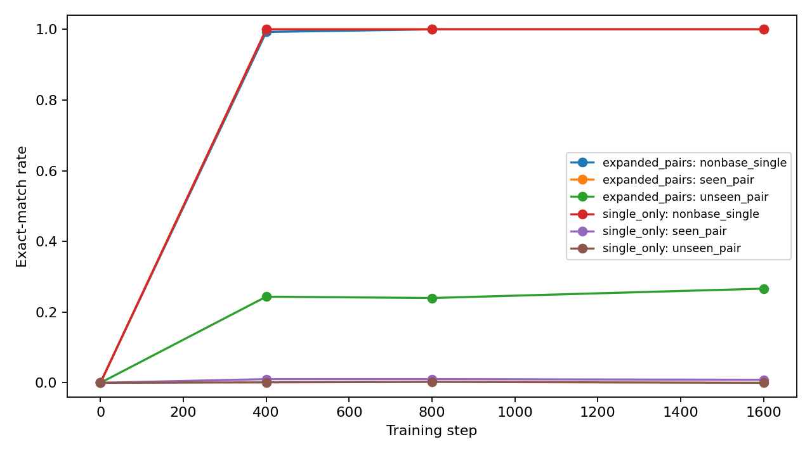

# GLT-BUILD-01A: Pair-Prefix Holdout

Completed exploratory run. This tests explicit command-prefix composition under a fixed synthetic grammar.

## Design

`expanded_pairs` receives identity, five singles and four taught pair prefixes. `single_only` receives identity and five singles only; no two-operation prefix is present in its training pool. Both arms use all 16 source-state variants for identity and singles, the same 360/88 scene split, three seeds, two layers, four heads, width 64, batch 64 and 1600 updates. Pair training is the only intended arm difference. The schedule is not paired because the arms have different command alphabets; initial seeds and model configuration are matched.

## Final Primitive And Pair Results

| arm | family | exact_match |
| --- | --- | --- |
| expanded_pairs | base_single | 1.0000 |
| expanded_pairs | nonbase_identity | 1.0000 |
| expanded_pairs | nonbase_single | 1.0000 |
| expanded_pairs | reverse_seen_pair | 0.0152 |
| expanded_pairs | seen_pair | 1.0000 |
| expanded_pairs | unseen_pair | 0.2664 |
| single_only | base_single | 1.0000 |
| single_only | nonbase_identity | 1.0000 |
| single_only | nonbase_single | 1.0000 |
| single_only | reverse_seen_pair | 0.0000 |
| single_only | seen_pair | 0.0085 |
| single_only | unseen_pair | 0.0000 |

| arm | pair | direct_ab_correct | direct_ba_correct | sequential_ab_correct | sequential_ba_correct | oracle_ab_correct | oracle_ba_correct | direct_both_correct | sequential_both_correct |
| --- | --- | --- | --- | --- | --- | --- | --- | --- | --- |
| expanded_pairs | NQ | 1.0000 | 0.0000 | 1.0000 | 1.0000 | 1.0000 | 1.0000 | 0.0000 | 1.0000 |
| expanded_pairs | NV | 0.0000 | 0.0000 | 1.0000 | 1.0000 | 1.0000 | 1.0000 | 0.0000 | 1.0000 |
| expanded_pairs | SQ | 0.7992 | 0.0000 | 1.0000 | 1.0000 | 1.0000 | 1.0000 | 0.0000 | 1.0000 |
| expanded_pairs | TN | 1.0000 | 0.0000 | 1.0000 | 1.0000 | 1.0000 | 1.0000 | 0.0000 | 1.0000 |
| expanded_pairs | TQ | 1.0000 | 0.0606 | 1.0000 | 1.0000 | 1.0000 | 1.0000 | 0.0606 | 1.0000 |
| expanded_pairs | TV | 0.0000 | 0.0000 | 1.0000 | 1.0000 | 1.0000 | 1.0000 | 0.0000 | 1.0000 |
| expanded_pairs | VQ | 1.0000 | 0.0000 | 1.0000 | 1.0000 | 1.0000 | 1.0000 | 0.0000 | 1.0000 |
| single_only | NQ | 0.0000 | 0.0000 | 1.0000 | 1.0000 | 1.0000 | 1.0000 | 0.0000 | 1.0000 |
| single_only | NV | 0.0000 | 0.0000 | 1.0000 | 1.0000 | 1.0000 | 1.0000 | 0.0000 | 1.0000 |
| single_only | SQ | 0.0000 | 0.0000 | 1.0000 | 1.0000 | 1.0000 | 1.0000 | 0.0000 | 1.0000 |
| single_only | TN | 0.0000 | 0.0000 | 1.0000 | 1.0000 | 1.0000 | 1.0000 | 0.0000 | 1.0000 |
| single_only | TQ | 0.0341 | 0.0000 | 1.0000 | 1.0000 | 1.0000 | 1.0000 | 0.0000 | 1.0000 |
| single_only | TV | 0.0000 | 0.0000 | 1.0000 | 1.0000 | 1.0000 | 1.0000 | 0.0000 | 1.0000 |
| single_only | VQ | 0.0000 | 0.0000 | 1.0000 | 1.0000 | 1.0000 | 1.0000 | 0.0000 | 1.0000 |

## Primary Decision

| arm | sequential_both_correct |
| --- | --- |
| expanded_pairs | 1.0000 |
| single_only | 1.0000 |

| arm | pair_seen_in_training | direct_ab_correct |
| --- | --- | --- |
| expanded_pairs | 0 | 0.0000 |
| expanded_pairs | 1 | 1.0000 |
| single_only | 0 | 0.0000 |
| single_only | 1 | 0.0085 |

The primary metric averages `sequential_both_correct` over TN, TQ, NQ, VQ, NV and TV, excluding SQ. Direct pair accuracy is reported separately for pairs seen and absent from the training pool. `single_only` is the critical test: it must execute a two-operation prefix without ever seeing a pair prefix during training.

Decision: **prefix_composition_not_supported**.

## Limits

All external operations commute in the generator. This run therefore tests composition of command tokens and the ability to reuse learned single-operation behavior; it does not test noncommuting algebra. The model remains small, the language is synthetic, and the direct pair test uses explicit operation tokens. Rates are descriptive across three seeds and 44 held-out groups; no p-value is claimed. Saved checkpoints and CSVs are indexed by `artifacts.json`.

