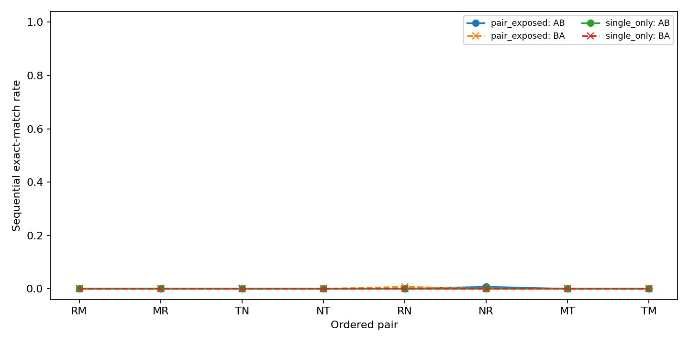

# GLT-BUILD-03: Template and Lexical Generalization Audit

Completed exploratory run testing a genuinely noncommuting pair in a controlled synthetic language.

## Design

`R` swaps subject and object. `M` toggles a mark on the current subject. Both are involutions, but `R` and `M` do not commute: marking then swapping marks the original subject as object, while swapping then marking marks the original object as subject. `T` toggles tense and `N` toggles negation; they are an independent commuting control.

The `single_only` arm sees identity and all four single operations, but no pair prefix. The `pair_exposed` arm additionally sees RM and TN pair prefixes on base sources. Both arms use the same 360/88 split, 12 source-state variants for identity/singles, three seeds, two layers, four heads, width 64, batch 64 and 1600 updates.

## Final Behavioral Results

| arm | family | exact_match |
| --- | --- | --- |
| pair_exposed | identity | 0.0000 |
| pair_exposed | single | 0.0015 |
| single_only | identity | 0.0000 |
| single_only | single | 0.0065 |

| arm | pair | order_distinct | direct_ab_correct | direct_ba_correct | sequential_ab_correct | sequential_ba_correct | oracle_ab_correct | oracle_ba_correct | direct_order_distinct_output | sequential_order_distinct_output |
| --- | --- | --- | --- | --- | --- | --- | --- | --- | --- | --- |
| pair_exposed | MR | 1.0000 | 0.0000 | 0.0000 | 0.0000 | 0.0000 | 0.0000 | 0.0000 | 0.9394 | 1.0000 |
| pair_exposed | MT | 0.0000 | 0.0000 | 0.0000 | 0.0000 | 0.0000 | 0.0000 | 0.0000 | 1.0000 | 0.6705 |
| pair_exposed | NR | 0.0000 | 0.0000 | 0.0000 | 0.0076 | 0.0000 | 0.0000 | 0.0000 | 0.5644 | 0.3864 |
| pair_exposed | NT | 0.0000 | 0.0000 | 0.0000 | 0.0000 | 0.0000 | 0.0000 | 0.0000 | 0.8220 | 0.0758 |
| pair_exposed | RM | 1.0000 | 0.0000 | 0.0000 | 0.0000 | 0.0000 | 0.0000 | 0.0000 | 0.9394 | 1.0000 |
| pair_exposed | RN | 0.0000 | 0.0000 | 0.0000 | 0.0000 | 0.0076 | 0.0000 | 0.0000 | 0.5644 | 0.3864 |
| pair_exposed | TM | 0.0000 | 0.0000 | 0.0000 | 0.0000 | 0.0000 | 0.0000 | 0.0000 | 1.0000 | 0.6705 |
| pair_exposed | TN | 0.0000 | 0.0000 | 0.0000 | 0.0000 | 0.0000 | 0.0000 | 0.0000 | 0.8220 | 0.0758 |
| single_only | MR | 1.0000 | 0.0000 | 0.0000 | 0.0000 | 0.0000 | 0.0000 | 0.0000 | 0.9621 | 1.0000 |
| single_only | MT | 0.0000 | 0.0000 | 0.0000 | 0.0000 | 0.0000 | 0.0000 | 0.0000 | 0.9167 | 0.5606 |
| single_only | NR | 0.0000 | 0.0000 | 0.0000 | 0.0000 | 0.0000 | 0.0000 | 0.0000 | 0.7235 | 0.1553 |
| single_only | NT | 0.0000 | 0.0000 | 0.0000 | 0.0000 | 0.0000 | 0.0000 | 0.0000 | 0.4848 | 0.1326 |
| single_only | RM | 1.0000 | 0.0000 | 0.0000 | 0.0000 | 0.0000 | 0.0000 | 0.0000 | 0.9621 | 1.0000 |
| single_only | RN | 0.0000 | 0.0000 | 0.0000 | 0.0000 | 0.0000 | 0.0000 | 0.0000 | 0.7235 | 0.1553 |
| single_only | TM | 0.0000 | 0.0000 | 0.0000 | 0.0000 | 0.0000 | 0.0000 | 0.0000 | 0.9167 | 0.5606 |
| single_only | TN | 0.0000 | 0.0000 | 0.0000 | 0.0000 | 0.0000 | 0.0000 | 0.0000 | 0.4848 | 0.1326 |

## Decision

| arm | direct_ab_correct | direct_ba_correct | sequential_ab_correct | sequential_ba_correct |
| --- | --- | --- | --- | --- |
| pair_exposed | 0.0000 | 0.0000 | 0.0009 | 0.0009 |
| single_only | 0.0000 | 0.0000 | 0.0000 | 0.0000 |

| arm | sequential_ab_correct | sequential_ba_correct | sequential_order_distinct_output |
| --- | --- | --- | --- |
| pair_exposed | 0.0000 | 0.0000 | 1.0000 |
| single_only | 0.0000 | 0.0000 | 1.0000 |

| arm | sequential_ab_correct | sequential_ba_correct | sequential_order_distinct_output |
| --- | --- | --- | --- |
| pair_exposed | 0.0000 | 0.0000 | 0.0758 |
| single_only | 0.0000 | 0.0000 | 0.1326 |

The primary order-sensitive contrast is RM versus MR. A successful result requires both sequential orders to be correct and to produce distinct outputs, while the TN/NT control should remain order-invariant. Direct prefix accuracy is reported separately because a model can execute two single commands sequentially without constructing a new pair prefix.

Decision: **order_sensitive_composition_not_supported**.

## Limits

This is a discrete finite-state composition test. It does not establish a Lie algebra, continuous generators, or a universal latent operator. Rates are descriptive across three seeds and 44 held-out groups. The language is synthetic and the pair-exposed arm has a different command alphabet, so the arms are matched by seed and architecture but not claimed to have identical command sampling.

## Generalization Audit

Training uses canonical and article-suffix templates for identity and single operations. Evaluation uses the unseen suffix-only combination on held-out scene groups. The test therefore probes surface-template recombination and lexical scene-group generalization together.

This is a stress test of the bounded GLT-BUILD-02 behavior. It does not turn the result into evidence for a universal operator or a Lie algebra.

## Template Control

The post-hoc [template control](CONTROL_SUMMARY.md) evaluates the same final
checkpoints on all three surface conditions. Canonical and article-suffix
templates, both present during training, reach 1.0000 for identity, singles,
and the tested sequential compositions. The suffix-only combination, held out
from training, reaches 0.0000 for identity and single operations and 0.0000
for RM/MR and TN/NT sequential correctness. This localizes the negative result
to surface-template recombination rather than to a general failure of the
learned operations on held-out scene groups.
